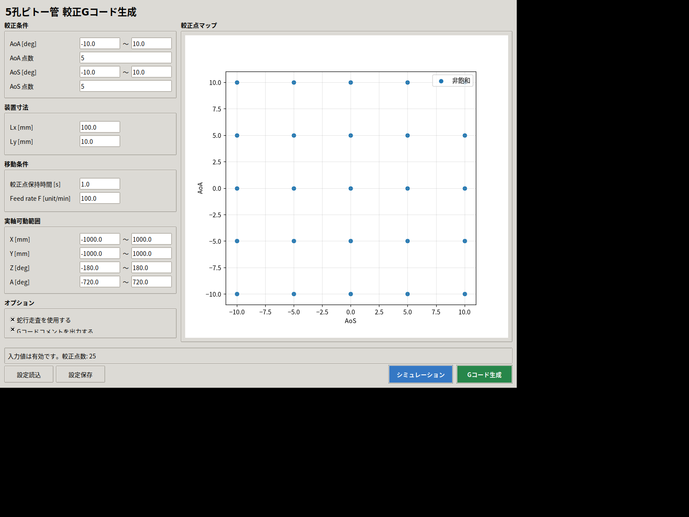
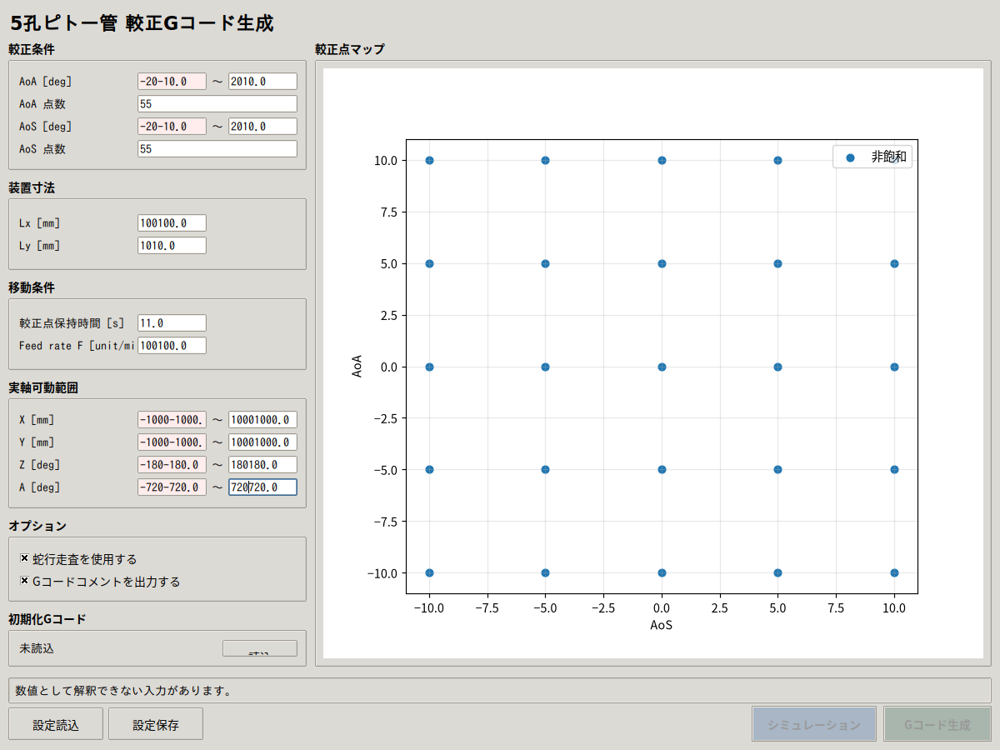
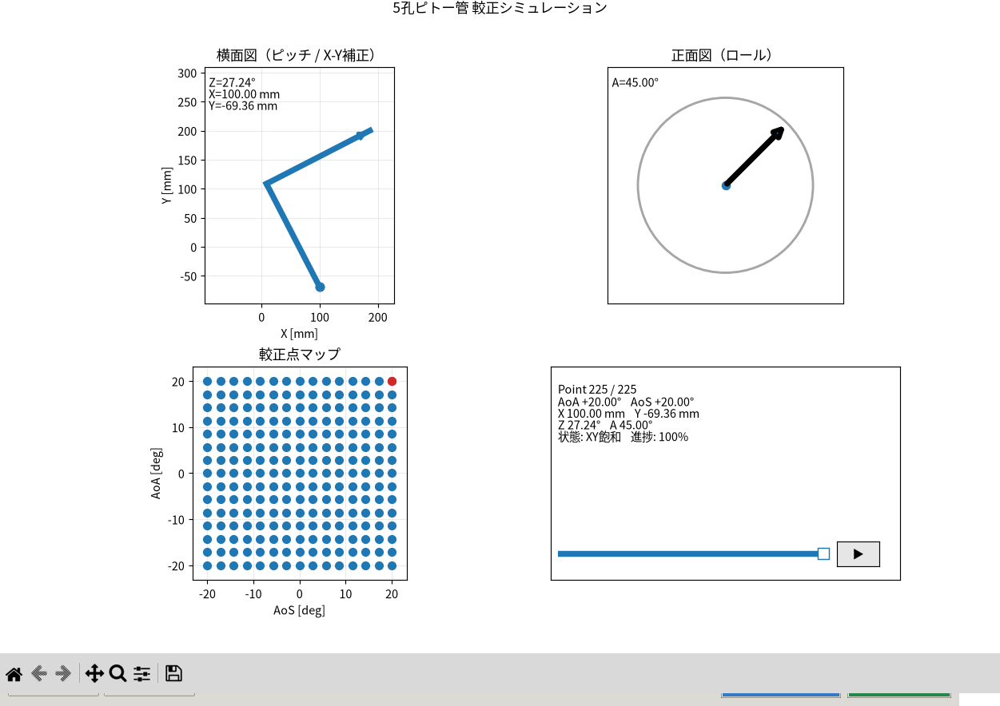
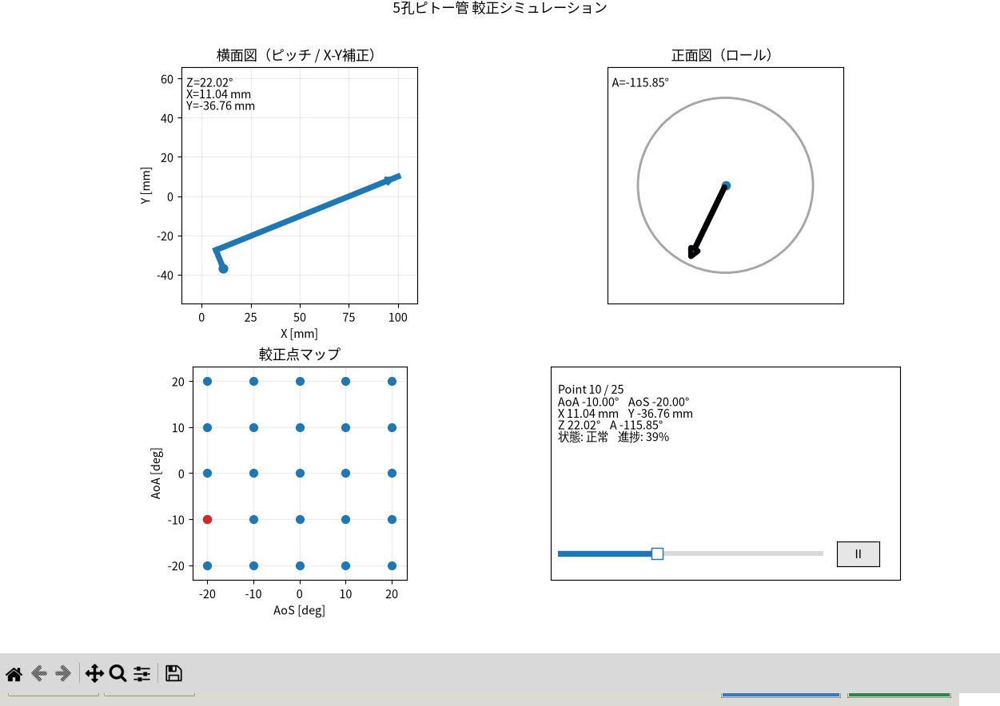
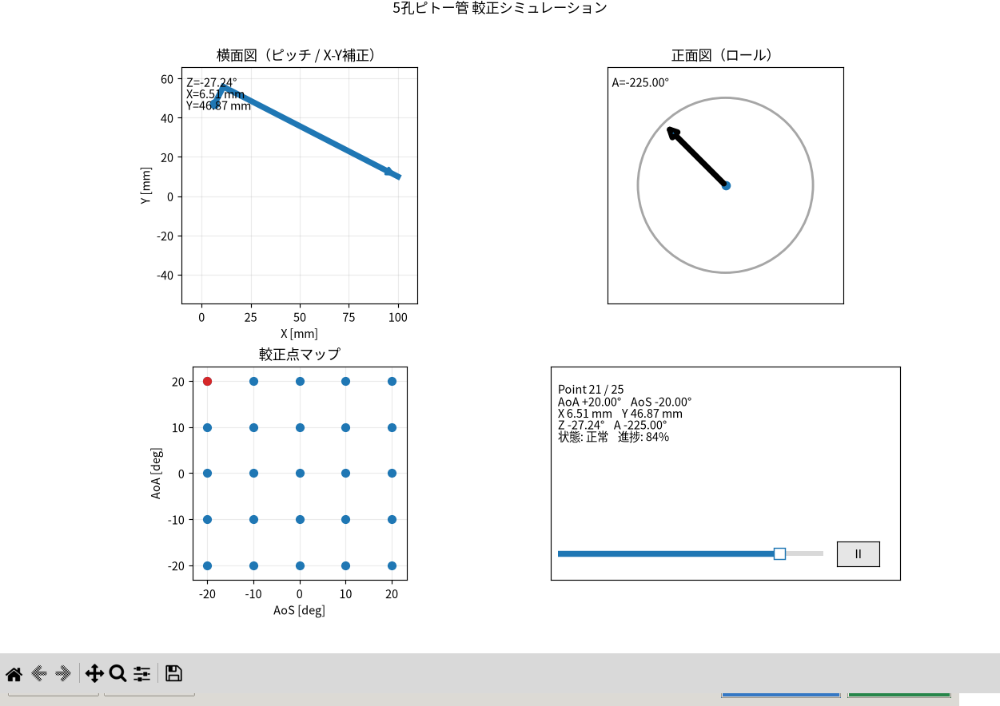

# 5孔ピトー管較正Gコード生成

5孔ピトー管の較正条件から、GRBL対応の4軸（X/Y/Z/A）Gコードを生成するGUIアプリケーションです。AoA/AoSの較正点を作成し、装置の実軸可動範囲、軸変換、蛇行走査、保持時間、Feed rateを考慮した較正計画を生成します。

## 主な機能

- AoA/AoSの範囲・点数を指定した較正点生成
- Pitch/RollおよびX/Y補正を含む実軸指令への変換
- 実軸可動範囲の検証と逸脱・生成禁止状態の表示
- 較正点マップによる走査順序の確認
- シミュレーションによる姿勢・較正点の再生確認
- 初期化Gコードの読込とGRBL向けGコードの生成
- 設定のCSV保存・読込
- 日本語GUIと要求・設計・テスト・APIのトレーサビリティ

## 起動方法

```bash
python -m pip install numpy matplotlib
python main.py
```

## 起動からGコード生成まで

1. `python main.py`を実行してGUIを起動します。
2. 較正条件（AoA/AoSの範囲と点数）を入力します。
3. 装置寸法、保持時間、Feed rateを入力します。
4. X/Y/Z/Aの実軸可動範囲を設定します。
5. 較正点マップと状態表示を確認します。
6. 「シミュレーション」を押し、横面図・正面図・較正点マップで走査を確認します。
7. 問題がなければ「Gコード生成」を押し、.ncファイルとして保存します。

以下のGIFは、製品GUIを実際に起動し、仮想デスクトップ上でマウスクリックとキーボード入力を行って取得した操作記録です。赤枠と注記で、その時点の操作対象を示しています。


### 起動直後



起動直後は、入力値を設定してください。初期値が表示されていても、実際の装置仕様に合わせて全項目を確認してください。

### 較正条件を設定する



| 項目 | 内容 | 注意点 |
|---|---|---|
| AoA [deg] | AoAの最小値・最大値 | 風洞条件と較正範囲に合わせる |
| AoA点数 | AoA方向の較正点数 | 2点未満は設定できない |
| AoS [deg] | AoSの最小値・最大値 | 対象とする横滑り角範囲を指定 |
| AoS点数 | AoS方向の較正点数 | 2点未満は設定できない |
| Lx/Ly | ピッチ中心から先端までの寸法 | 単位はmm |
| 保持時間 | 各較正点の保持時間 | Gコードの待機時間へ反映 |
| Feed rate | 移動速度 | GコードのF値として扱う |

入力後、右側の較正点マップで点数と走査範囲を確認します。

### 実軸可動範囲とオプション

X/Yはmm、Z/Aはdegで入力します。指定範囲を超える場合は状態表示に逸脱量が表示され、Z/Aの可動範囲外はGコード生成が禁止されます。

- 「蛇行走査を使用する」：隣接点への移動量を抑える走査順を使用します。
- 「Gコードコメントを出力する」：較正点情報をGコードコメントへ出力します。
- 「初期化Gコード 読込」：必要な初期化コードを読み込みます。

### シミュレーションする



「シミュレーション」を押すと、較正計画を変更せずに表示を再生します。シミュレーション画面では横面図、正面図、較正点マップ、シークバー、再生／一時停止を確認できます。



- シミュレーションは実機を動かしません。
- 表示で問題がある場合は、Gコードを生成しないでください。
- 完了後は最終較正点を保持し、自動ループしません。
- 条件を変更した場合は、再度シミュレーションしてください。

### Gコードを生成する



1. 入力値が有効であることを確認します。
2. X/Y逸脱量、Z/A可動範囲外警告がないことを確認します。
3. シミュレーションで走査順を確認します。
4. 「Gコード生成」を押します。
5. 保存先と.ncファイル名を指定します。
6. 「Gコードを保存しました。」の表示を確認します。

生成後は、ファイル内容を確認してからCNC.js／GRBLへ読み込んでください。

### 設定を保存・読み込みする

「設定保存」でCSVへ保存し、「設定読込」で復元します。読み込み後は全入力欄、較正点マップ、状態表示を確認してください。

### 代表的な注意点

- AoA/AoSの単位はdeg、寸法の単位はmmです。
- ±30degを超えるAoA/AoSは警告対象です。
- 実軸のZ/A範囲外を無視して生成しないでください。
- 実機運転前に、CNC.js、GRBL、原点、工具・治具、非常停止を確認してください。
- シミュレーションは機械の安全確認や干渉確認を完全には代替しません。

## ドキュメント

- [要求仕様書](https://pakfat50.github.io/FiveHolePitotTubeCalibration/pitot_calibration_gui_spec/)
- [アーキテクチャ設計書](https://pakfat50.github.io/FiveHolePitotTubeCalibration/architecture_design/)
- [テスト仕様書](https://pakfat50.github.io/FiveHolePitotTubeCalibration/test_specification/)
- [製品コードAPI](https://pakfat50.github.io/FiveHolePitotTubeCalibration/api/)
- [テストコードAPI](https://pakfat50.github.io/FiveHolePitotTubeCalibration/test-api/)
- [開発プロセスルール](https://pakfat50.github.io/FiveHolePitotTubeCalibration/development_process_guideline/)
- [トレーサビリティ運用ルール](https://pakfat50.github.io/FiveHolePitotTubeCalibration/traceability_rules/)
- [製品コード開発ルール](https://pakfat50.github.io/FiveHolePitotTubeCalibration/product_code_guideline/)
- [テストコード開発ルール](https://pakfat50.github.io/FiveHolePitotTubeCalibration/test_doxygen_guideline/)

## 開発者向け

```bash
python tools/check_artifacts.py
python -m unittest discover -s tests -v
```

ドキュメントサイトをローカルで確認する場合は、リポジトリのルートで以下を実行します。

```bash
python -m pip install mkdocs-material "mkdocstrings[python]"
mkdocs serve
```

ブラウザで `http://127.0.0.1:8000/` を開きます。

## ライセンス

[MIT License](LICENSE)
