# 5孔ピトー管較正Gコード生成GUI アーキテクチャ設計書

## 1. 目的

本書は、`docs/pitot_calibration_gui_spec.md` に定義された要求を、Pythonでテスト・保守しやすいソフトウェアへ実装するためのアーキテクチャを定義する。

設計方針は以下とする。

- レイヤードアーキテクチャを採用する。
- 数値計算・判定処理は可能な限り副作用のない関数またはステートレスなクラスとして実装する。
- GUI、シミュレーション、ファイルI/Oなど状態・副作用を伴う処理はクラスへ分離する。
- GUI層から数値計算ロジックを分離し、GUIを起動せず単体テスト可能とする。
- 依存方向は Presentation → Application → Domain/Core とし、Domain/Core からGUIやファイルI/Oへ依存しない。
- 標準ライブラリ、NumPy、Matplotlibのみを使用する。GUIは標準ライブラリのTkinterを使用する。
- 単体テストは標準ライブラリの `unittest` を使用する。
- 各実装関数・メソッドには対応要求IDをコメントまたはdocstringで明記する。
- 既存要求IDは変更しない。削除要求が将来発生した場合もIDを再利用・再採番しない。

---

# 2. ユースケース図

## 2.1 ユースケース一覧

| ID | ユースケース | 概要 |
|---|---|---|
| UC-01 | 較正条件を入力・更新する | AoA/AoS範囲、点数、寸法、保持時間、Feed rate、軸可動範囲、オプションを入力し、リアルタイムに検証・較正点再計算する |
| UC-02 | 初期化Gコードを読み込む | テキストファイルから初期化Gコードを読み込む |
| UC-03 | 設定を保存する | 現在の入力条件・オプションを設定ファイルへ保存する |
| UC-04 | 設定を読み込む | 設定ファイルから入力条件・オプションを復元し、再検証・再計算する |
| UC-05 | シミュレーションする | 有効な較正計画を約10秒で可視化する |
| UC-06 | Gコードを生成する | 有効な較正計画から `.nc` Gコードを生成・保存する |

## 2.2 PlantUML

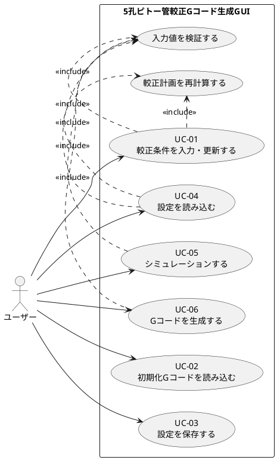

---

# 3. シーケンス図

## 3.1 UC-01 較正条件を入力・更新する

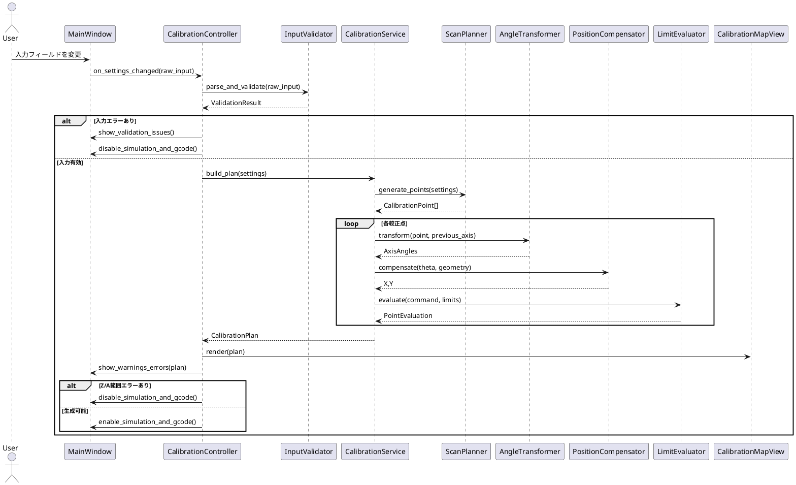

## 3.2 UC-02 初期化Gコードを読み込む

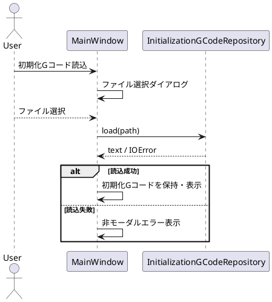

## 3.3 UC-03 設定を保存する

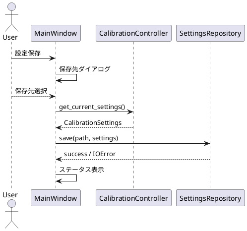

## 3.4 UC-04 設定を読み込む

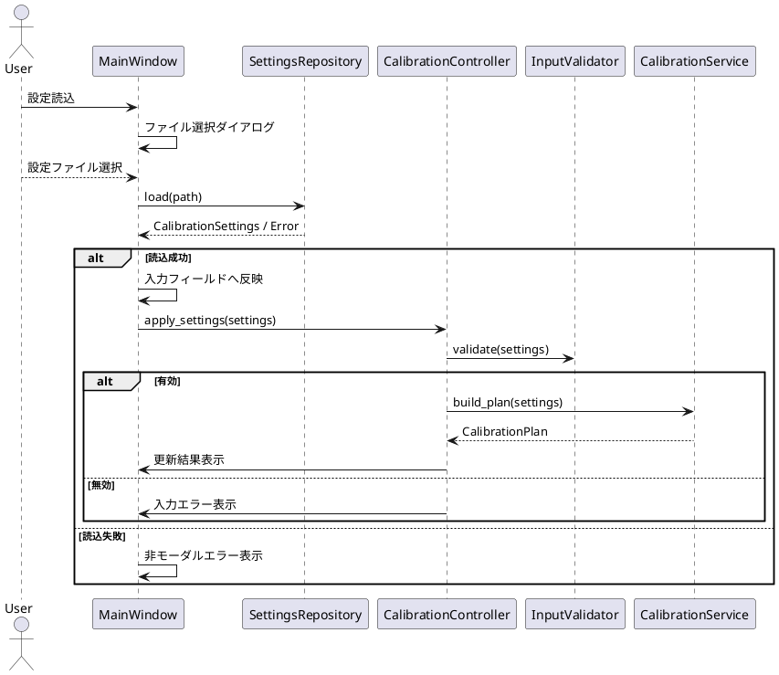

## 3.5 UC-05 シミュレーションする

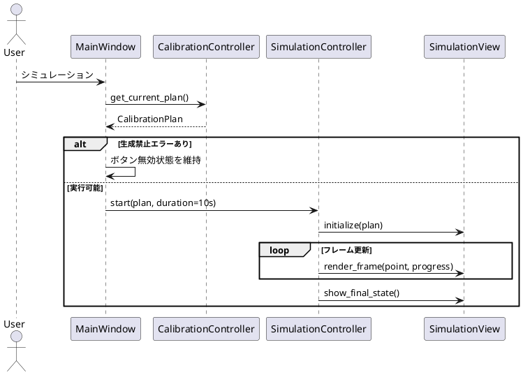

## 3.6 UC-06 Gコードを生成する

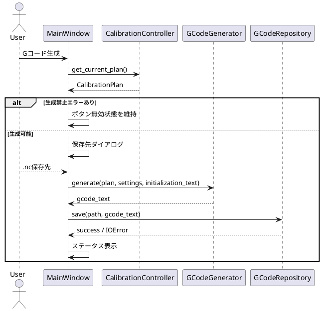

---

# 4. クラス図

```plantuml
@startuml
skinparam classAttributeIconSize 0

package "Domain / Model" {
  class CalibrationSettings <<dataclass>> {
    +aoa_min: float
    +aoa_max: float
    +aos_min: float
    +aos_max: float
    +aoa_points: int
    +aos_points: int
    +tip_offset_x: float
    +tip_offset_y: float
    +hold_time_s: float
    +feed_rate: float
    +axis_limits: AxisLimits
    +serpentine: bool
    +output_comments: bool
  }

  class AxisRange <<dataclass>> {
    +minimum: float
    +maximum: float
  }

  class AxisLimits <<dataclass>> {
    +x: AxisRange
    +y: AxisRange
    +z: AxisRange
    +a: AxisRange
  }

  class CalibrationPoint <<dataclass>> {
    +index: int
    +aoa: float
    +aos: float
  }

  class AxisCommand <<dataclass>> {
    +x: float
    +y: float
    +z: float
    +a: float
  }

  class PointEvaluation <<dataclass>> {
    +point: CalibrationPoint
    +ideal_command: AxisCommand
    +command: AxisCommand
    +x_saturated: bool
    +y_saturated: bool
    +x_deviation: float
    +y_deviation: float
    +rotational_error: bool
  }

  class ValidationIssue <<dataclass>> {
    +field: str
    +severity: Severity
    +message: str
  }

  class ValidationResult <<dataclass>> {
    +issues: list[ValidationIssue]
    +is_valid: bool
  }

  class CalibrationPlan <<dataclass>> {
    +settings: CalibrationSettings
    +points: list[PointEvaluation]
    +max_x_deviation: float
    +max_y_deviation: float
    +has_generation_error: bool
  }

  enum Severity {
    ERROR
    WARNING
  }
}

package "Core" {
  class InputValidator {
    +validate(settings): ValidationResult
  }
  class ScanPlanner {
    +generate_points(settings): list[CalibrationPoint]
  }
  class AngleTransformer {
    +transform(aoa, aos, previous, limits): tuple[float,float]
    -generate_equivalent_solutions(theta, phi): list
    -select_solution(candidates, previous, limits): tuple
    -unwrap_angle(angle, previous): float
  }
  class PositionCompensator {
    +calculate_xy(theta, lx, ly): tuple[float,float]
  }
  class LimitEvaluator {
    +evaluate(command, limits): PointEvaluation
    -saturate_translation(value, range): tuple
    -rotation_in_range(value, range): bool
  }
}

package "Application" {
  class CalibrationService {
    +build_plan(settings): CalibrationPlan
  }
  class CalibrationController {
    +on_settings_changed(raw_input)
    +apply_settings(settings)
    +get_current_settings(): CalibrationSettings
    +get_current_plan(): CalibrationPlan
    +can_generate(): bool
  }
}

package "Infrastructure" {
  class SettingsRepository {
    +save(path, settings)
    +load(path): CalibrationSettings
  }
  class InitializationGCodeRepository {
    +load(path): str
  }
  class GCodeGenerator {
    +generate(plan, settings, initialization_text): str
    -format_header(initialization_text): list[str]
    -format_point(point_eval, settings): list[str]
  }
  class GCodeRepository {
    +save(path, text)
  }
}

package "Presentation" {
  class MainWindow {
    +run()
    -build_widgets()
    -collect_raw_input()
    -on_input_changed()
    -update_validation_display()
    -update_action_state()
    -on_load_initialization()
    -on_save_settings()
    -on_load_settings()
    -on_simulate()
    -on_generate_gcode()
  }
  class CalibrationMapView {
    +render(plan)
  }
  class SimulationController {
    +start(plan, duration_s)
    -frame_at(progress)
  }
  class SimulationView {
    +initialize(plan)
    +render_frame(point, progress)
    +show_final_state()
  }
}

AxisLimits *-- AxisRange
CalibrationSettings *-- AxisLimits
CalibrationPlan *-- PointEvaluation
PointEvaluation *-- CalibrationPoint
PointEvaluation *-- AxisCommand
ValidationResult *-- ValidationIssue
ValidationIssue --> Severity

CalibrationService --> ScanPlanner
CalibrationService --> AngleTransformer
CalibrationService --> PositionCompensator
CalibrationService --> LimitEvaluator
CalibrationController --> InputValidator
CalibrationController --> CalibrationService
MainWindow --> CalibrationController
MainWindow --> SettingsRepository
MainWindow --> InitializationGCodeRepository
MainWindow --> GCodeGenerator
MainWindow --> GCodeRepository
MainWindow --> CalibrationMapView
MainWindow --> SimulationController
SimulationController --> SimulationView
@enduml
```

---

# 5. ソフトウェア内部ブロック図

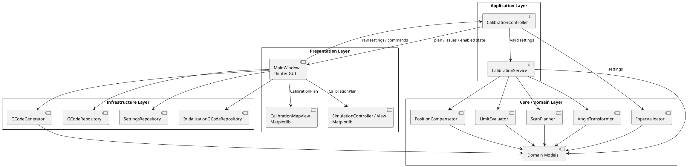

## 5.1 主データフロー

1. ユーザー入力を `MainWindow` が収集する。
2. `CalibrationController` がGUI入力を `CalibrationSettings` へ変換し、`InputValidator` で検証する。
3. 有効な場合のみ `CalibrationService` が `CalibrationPlan` を生成する。
4. `CalibrationService` は `ScanPlanner` → `AngleTransformer` → `PositionCompensator` → `LimitEvaluator` の順に処理する。
5. `CalibrationPlan` はGUIの較正点マップ、Summary、シミュレーション、Gコード生成で共通利用する。
6. Gコード生成時に再度独立した別計算を行わず、GUI表示・シミュレーションと同じ `CalibrationPlan` を使用する。

この「単一計算結果の共有」により、GUI表示と出力Gコードの不一致を防止する。

---

# 6. モジュールリスト

| Pythonモジュール名 | 日本語での意味 | 主なクラス/関数 | 機能概要 |
|---|---|---|---|
| `models.py` | データモデル | `CalibrationSettings`, `AxisLimits`, `CalibrationPoint`, `AxisCommand`, `PointEvaluation`, `CalibrationPlan` | 各層間で受け渡す型を定義する。計算ロジックやGUI依存を持たない |
| `validation.py` | 入力検証 | `InputValidator.validate()` | 入力範囲、点数、保持時間、Feed rate、寸法、可動範囲等を検証し、フィールド単位のエラー情報を返す |
| `scan.py` | 較正点走査計画 | `ScanPlanner.generate_points()` | AoA/AoS等間隔格子、AoA外側ループ、AoS内側ループ、蛇行走査を生成する |
| `transform.py` | 角度座標変換 | `AngleTransformer.transform()`, `generate_equivalent_solutions()`, `select_solution()`, `unwrap_angle()` | AoA/AoSからZ/Aを算出し、等価解・可動範囲・連続性を考慮して解を決定する |
| `positioning.py` | 先端位置補正 | `PositionCompensator.calculate_xy()` | ピッチ回転による先端変位からX/Y補正量を算出する |
| `limits.py` | 可動範囲判定 | `LimitEvaluator.evaluate()` | X/Y飽和、X/Y偏差、Z/A範囲エラーを判定する |
| `calibration_service.py` | 較正計画生成サービス | `CalibrationService.build_plan()` | 点列生成から軸指令、補正、制限判定までを統合し `CalibrationPlan` を構築する |
| `controller.py` | アプリケーション制御 | `CalibrationController` | GUIイベントを受け、入力検証と較正計画再生成を制御し、現在状態を保持する |
| `gcode.py` | Gコード生成 | `GCodeGenerator.generate()` | 初期化コード、`$H`, `G21`, `G90`, `G94`, `G01 ... F...`, `G04`、任意コメントを文字列化する |
| `repositories.py` | ファイル入出力 | `SettingsRepository`, `InitializationGCodeRepository`, `GCodeRepository` | JSON設定、初期化Gコード、`.nc`ファイルの読み書きを担当する |
| `map_view.py` | 較正点マップ表示 | `CalibrationMapView` | MatplotlibでAoA/AoS点列と警告・エラー状態を表示する |
| `simulation.py` | 動作シミュレーション | `SimulationController`, `SimulationView` | 約10秒の再生、横面図・正面図、現在点・軸値・進捗を表示する |
| `gui.py` | GUI | `MainWindow` | Tkinter画面、入力フィールド、ボタン、非モーダルエラー表示、ファイルダイアログを提供する |
| `main.py` | エントリポイント | `main()` | アプリケーションを初期化してGUIを起動する |

---

# 7. データモデル図

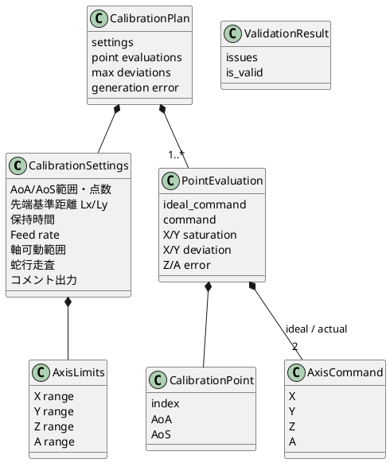

## 7.1 データ不変条件

- `CalibrationPlan` は、入力検証に成功した `CalibrationSettings` からのみ生成する。
- `PointEvaluation.ideal_command` は飽和前の計算結果を保持する。
- `PointEvaluation.command` はGコードおよびシミュレーションに実際に使用する指令値を保持する。
- X/Y範囲超過時のみ `command` を飽和させる。
- Z/A範囲超過時は `command` を飽和させず、`rotational_error` を設定する。
- GUI、シミュレーション、Gコード生成は同一 `CalibrationPlan` を参照する。

---

# 8. 状態遷移図

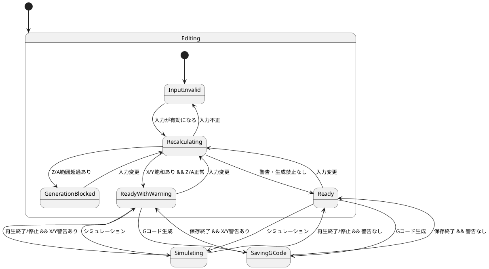

## 8.1 状態別GUI動作

| 状態 | 較正点マップ | シミュレーション | Gコード生成 | 表示 |
|---|---|---|---|---|
| InputInvalid | 更新停止または直前有効結果を保持 | 無効 | 無効 | 入力フィールドを強調、理由表示 |
| Recalculating | 更新中 | 無効 | 無効 | 必要に応じ内部状態のみ |
| GenerationBlocked | 表示可 | 無効 | 無効 | Z/A生成禁止エラー |
| ReadyWithWarning | 表示可 | 有効 | 有効 | X/Y飽和警告・最大偏差 |
| Ready | 表示可 | 有効 | 有効 | 正常 |
| Simulating | 表示可 | 実行中 | 原則無効 | 進捗・現在点 |
| SavingGCode | 表示可 | 原則無効 | 実行中 | 保存状態 |

---

# 9. 要求仕様ID－クラス/メソッド トレーサビリティマトリックス

## 9.1 入力・検証

| 要求ID | 実装クラス/メソッド | 備考 |
|---|---|---|
| REQ-INPUT-001 | `MainWindow._build_widgets`, `MainWindow._collect_raw_input`, `CalibrationSettings` | AoA/AoS範囲 |
| REQ-INPUT-002 | `MainWindow._build_widgets`, `MainWindow._collect_raw_input`, `CalibrationSettings` | 点数 |
| REQ-INPUT-003 | `MainWindow._build_widgets`, `MainWindow._collect_raw_input`, `CalibrationSettings` | Lx/Ly |
| REQ-INPUT-004 | `MainWindow._build_widgets`, `MainWindow._collect_raw_input`, `CalibrationSettings`, `GCodeGenerator.format_point` | 保持時間、Feed rate |
| REQ-INPUT-005 | `MainWindow._build_widgets`, `AxisLimits`, `AxisRange` | X/Y/Z/A可動範囲 |
| REQ-INPUT-006 | `MainWindow._on_load_initialization`, `InitializationGCodeRepository.load` | 初期化Gコード |
| REQ-INPUT-007 | `MainWindow._build_widgets`, `CalibrationSettings` | 蛇行走査、コメント |
| REQ-VALID-001 | `CalibrationController.on_settings_changed`, `InputValidator.validate`, `MainWindow._update_validation_display` | リアルタイム非モーダル検証 |
| REQ-VALID-002 | `InputValidator.validate`, `CalibrationController.can_generate` | 入力整合性 |
| REQ-VALID-003 | `LimitEvaluator.evaluate`, `CalibrationController.can_generate`, `MainWindow._update_action_state` | X/Y警告、Z/A禁止 |

## 9.2 座標変換・位置補正・制限

| 要求ID | 実装クラス/メソッド | 備考 |
|---|---|---|
| REQ-TRANS-001 | `AngleTransformer.transform` | ピッチ後ロールのモデル |
| REQ-TRANS-002 | `AngleTransformer.transform`, `AngleTransformer._generate_equivalent_solutions` | AoA/AoS→Z/A |
| REQ-TRANS-003 | `AngleTransformer._select_solution` | 等価解優先順位 |
| REQ-TRANS-004 | `AngleTransformer._unwrap_angle` | ±360°ジャンプ回避 |
| REQ-POS-001 | `PositionCompensator.calculate_xy` | X/Y補正式 |
| REQ-POS-002 | `PositionCompensator.calculate_xy` | ロール非依存 |
| REQ-LIMIT-001 | `LimitEvaluator.evaluate`, `LimitEvaluator._saturate_translation` | X/Y飽和 |
| REQ-LIMIT-002 | `LimitEvaluator.evaluate`, `CalibrationService.build_plan`, `MainWindow._update_validation_display` | 最大X/Y偏差 |
| REQ-LIMIT-003 | `LimitEvaluator.evaluate`, `LimitEvaluator._rotation_in_range`, `CalibrationController.can_generate` | Z/A生成禁止 |

## 9.3 較正点走査

| 要求ID | 実装クラス/メソッド | 備考 |
|---|---|---|
| REQ-SCAN-001 | `ScanPlanner.generate_points`, `CalibrationController.on_settings_changed` | 等間隔・自動再生成 |
| REQ-SCAN-002 | `ScanPlanner.generate_points` | AoA外側、AoS内側 |
| REQ-SCAN-003 | `ScanPlanner.generate_points` | 蛇行 |

## 9.4 Gコード

| 要求ID | 実装クラス/メソッド | 備考 |
|---|---|---|
| REQ-GCODE-001 | `MainWindow._on_generate_gcode`, `GCodeRepository.save` | `.nc`保存 |
| REQ-GCODE-002 | `GCodeGenerator._format_header` | 初期化、`$H`, G21/G90/G94 |
| REQ-GCODE-003 | `GCodeGenerator._format_point` | `G01 X Y Z A F`, `G04 P` |
| REQ-GCODE-004 | `GCodeGenerator._format_point` | 任意コメント |
| REQ-GCODE-005 | `GCodeGenerator.generate` | 終了時復帰指令なし |

## 9.5 シミュレーション

| 要求ID | 実装クラス/メソッド | 備考 |
|---|---|---|
| REQ-SIM-001 | `MainWindow._on_simulate`, `CalibrationController.can_generate` | 任意実行 |
| REQ-SIM-002 | `SimulationController.start`, `SimulationController._frame_at` | 約10秒、保持時間非再現 |
| REQ-SIM-003 | `SimulationView.initialize`, `SimulationView.render_frame` | 横面図・正面図 |
| REQ-SIM-004 | `SimulationView.render_frame` | 点番号、AoA/AoS、X/Y/Z/A、状態、進捗 |

## 9.6 GUI

| 要求ID | 実装クラス/メソッド | 備考 |
|---|---|---|
| REQ-GUI-001 | `MainWindow._build_widgets` | 日本語GUI |
| REQ-GUI-002 | `CalibrationMapView.render` | AoA/AoSマップ、警告/エラー識別 |
| REQ-GUI-003 | `MainWindow._on_save_settings`, `MainWindow._on_load_settings`, `SettingsRepository.save/load` | 設定保存読込 |
| REQ-GUI-004 | `MainWindow._build_widgets` | 4操作ボタン |
| REQ-GUI-005 | `MainWindow._update_validation_display`, `MainWindow._update_action_state`, `CalibrationController.can_generate` | 非モーダル表示、ボタン制御 |

---

# 10. メソッド単位の責務定義

後続のテスト設計で試験対象を明確にするため、主要メソッドの責務境界を以下に固定する。

| モジュール | メソッド | 入力 | 出力 | 副作用 |
|---|---|---|---|---|
| validation | `InputValidator.validate` | `CalibrationSettings` | `ValidationResult` | なし |
| scan | `ScanPlanner.generate_points` | `CalibrationSettings` | `list[CalibrationPoint]` | なし |
| transform | `AngleTransformer.transform` | AoA, AoS, previous, limits | Z, A | なし |
| transform | `_generate_equivalent_solutions` | Z, A基本解 | 候補解 | なし |
| transform | `_select_solution` | 候補解, previous, limits | 1解 | なし |
| transform | `_unwrap_angle` | angle, previous | unwrap角 | なし |
| positioning | `PositionCompensator.calculate_xy` | Z角, Lx, Ly | X, Y | なし |
| limits | `LimitEvaluator.evaluate` | `AxisCommand`, `AxisLimits` | 制限判定結果 | なし |
| calibration_service | `CalibrationService.build_plan` | `CalibrationSettings` | `CalibrationPlan` | なし |
| gcode | `GCodeGenerator.generate` | plan, settings, init text | Gコード文字列 | なし |
| repositories | `SettingsRepository.save/load` | path/settings | settings/None | ファイルI/O |
| repositories | `InitializationGCodeRepository.load` | path | text | ファイルI/O |
| repositories | `GCodeRepository.save` | path/text | None | ファイルI/O |
| controller | `CalibrationController.on_settings_changed` | GUI入力 | 状態更新 | 内部状態更新 |
| simulation | `SimulationController.start` | plan | None | UI更新/タイマー |
| map_view | `CalibrationMapView.render` | plan | None | 描画 |
| gui | `MainWindow`各イベント | ユーザー操作 | None | GUI/ダイアログ |

---

# 11. 実装上の設計ルール

1. Core層の関数・メソッドはTkinter、Matplotlib、ファイルI/Oへ依存させない。
2. `CalibrationService.build_plan()` はGUI状態を参照せず、引数だけで同じ結果を返す決定的処理とする。
3. 浮動小数点比較は後続テスト設計で許容誤差を明示する。
4. `CalibrationPlan` を較正点マップ・シミュレーション・Gコード生成の単一ソースとする。
5. X/Yの飽和前値を必ず保持し、偏差計算・警告表示に使用する。
6. Z/Aは範囲超過時に値を改変しない。
7. 設定保存形式は標準ライブラリ `json` を用いる。スキーマバージョンを設定ファイルに保持し、将来拡張可能とする。
8. GUI入力値のパース失敗と、パース成功後の意味的検証エラーを区別する。
9. 入力変更イベントはモーダルダイアログを発生させない。
10. ファイル選択・保存失敗などユーザー起点I/Oの失敗は、アプリケーションを終了させずGUI上で通知する。
11. コード内の各関数・メソッドには `Requirements: REQ-...` を記載する。
12. テストコードには後続で定義する `TEST-...` IDをコメントで記載する。

---

# 12. Phase 2への入力

次段階の単体テスト設計では、本書の「メソッド単位の責務定義」を試験単位とし、以下を作成する。

- 各メソッドの正常系、境界値、異常系、数値精度、状態遷移のテスト観点
- 個別テストID
- 要求ID → テストID トレーサビリティマトリックス
- モジュール/メソッド → テストID 対応表

Phase 2開始前に、本アーキテクチャ設計についてユーザーレビューを受ける。
