# 5孔ピトー管較正Gコード生成GUI アーキテクチャ設計書

## 1. 目的

本書は、`docs/pitot_calibration_gui_spec.md` に定義された要求を、Pythonでテスト・保守しやすいソフトウェアへ実装するためのアーキテクチャを定義する。

設計方針は以下とする。

- レイヤードアーキテクチャを採用する。
- 数値計算・判定処理は可能な限り副作用のない関数またはステートレスなクラスとして実装する。
- GUI、シミュレーション、ファイルI/Oなど状態・副作用を伴う処理はクラスへ分離する。
- GUI層から数値計算ロジックを分離し、GUIを起動せず単体テスト可能とする。
- 依存方向は Presentation → Application → Domain/Core とし、Domain/Core からGUIやファイルI/Oへ依存しない。
- 標準ライブラリ、NumPy、Matplotlibのみを使用する。GUIは標準ライブラリのTkinterを使用する。
- 単体テストは標準ライブラリの `unittest` を使用する。
- 各実装関数・メソッドには対応要求IDをコメントまたはdocstringで明記する。
- 既存要求IDは変更しない。削除要求が将来発生した場合もIDを再利用・再採番しない。
- GitHub上で直接レビューできるよう、設計図はMermaidで記述する。

---

# 2. ユースケース図

## 2.1 ユースケース一覧

| ID | ユースケース | 概要 | テスト仕様 |
|---|---|---|---|
| UC-01 | 較正条件を入力・更新する | AoA/AoS範囲、点数、寸法、保持時間、Feed rate、軸可動範囲、オプションを入力し、リアルタイムに検証・較正点再計算する | [[UCTEST:UC-01]] |
| UC-02 | 初期化Gコードを読み込む | テキストファイルから初期化Gコードを読み込む | [[UCTEST:UC-02]] |
| UC-03 | 設定を保存する | 現在の入力条件・オプションをCSV設定ファイルへ保存する | [[UCTEST:UC-03]] |
| UC-04 | 設定を読み込む | CSV設定ファイルから入力条件・オプションを復元し、再検証・再計算する | [[UCTEST:UC-04]] |
| UC-05 | シミュレーションする | 有効な較正計画を約10秒で可視化し、機構姿勢とAoA/AoS較正点の対応を同時表示する | [[UCTEST:UC-05]] |
| UC-06 | Gコードを生成する | 有効な較正計画から `.nc` Gコードを生成・保存する | [[UCTEST:UC-06]] |

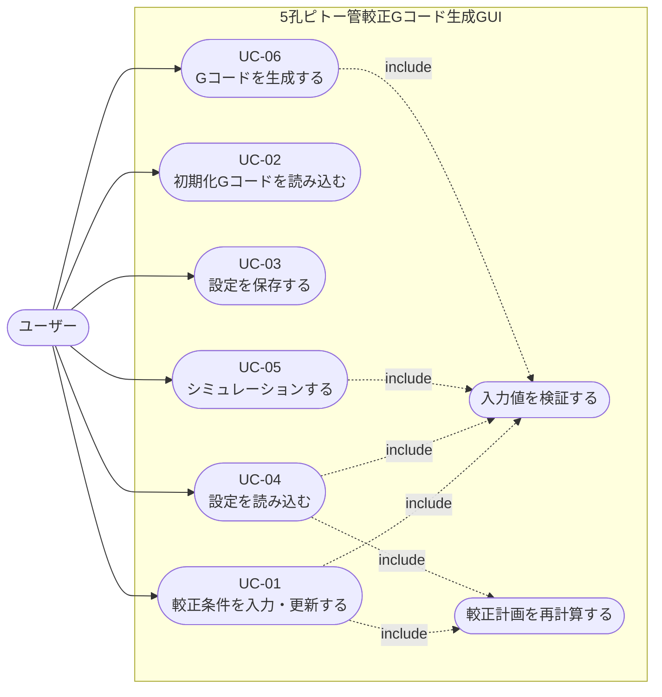

---

# 3. シーケンス図

## 3.1 UC-01 較正条件を入力・更新する

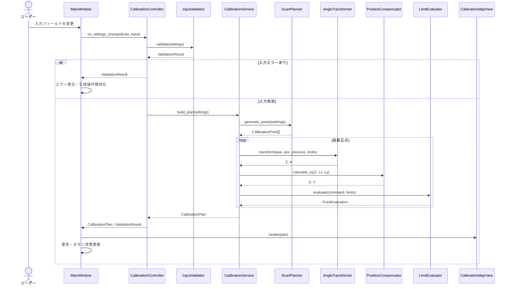

## 3.2 UC-02 初期化Gコードを読み込む

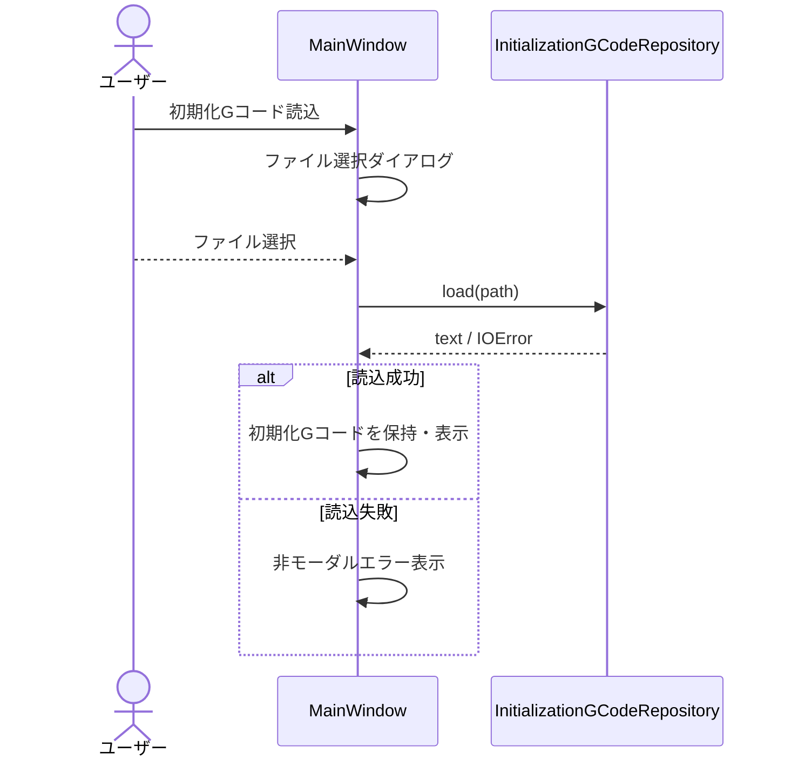

## 3.3 UC-03 設定を保存する

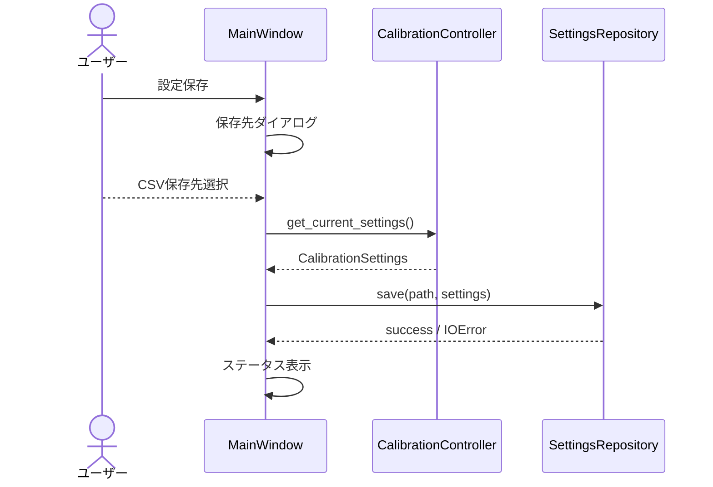

## 3.4 UC-04 設定を読み込む

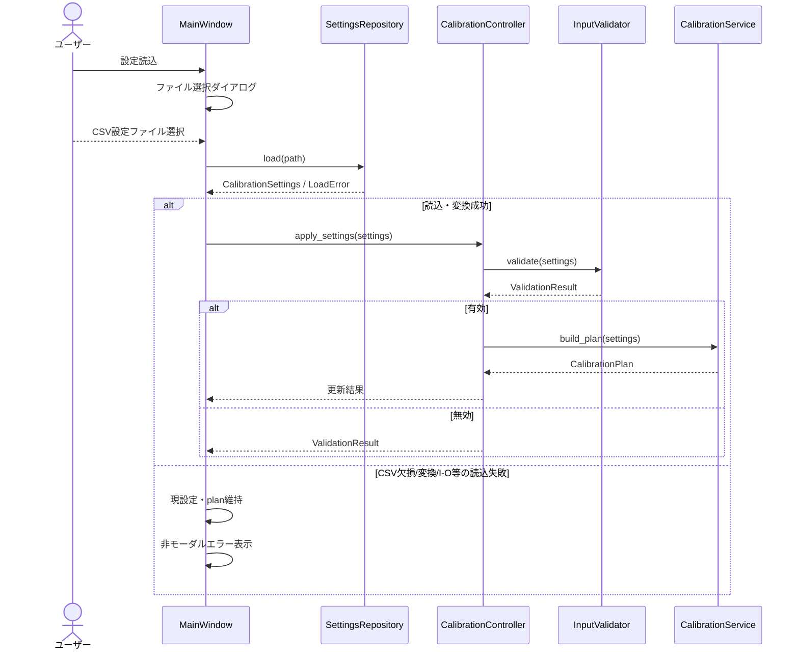

## 3.5 UC-05 シミュレーションする

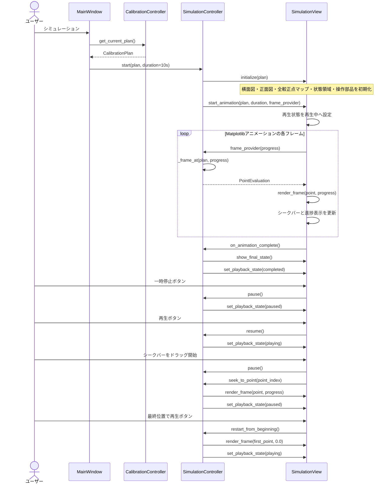

ユースケーステスト: [[UCTEST:UC-05]]

対応要求: [[ARCHREQ:REQ-SIM-007]]

## 3.6 UC-06 Gコードを生成する

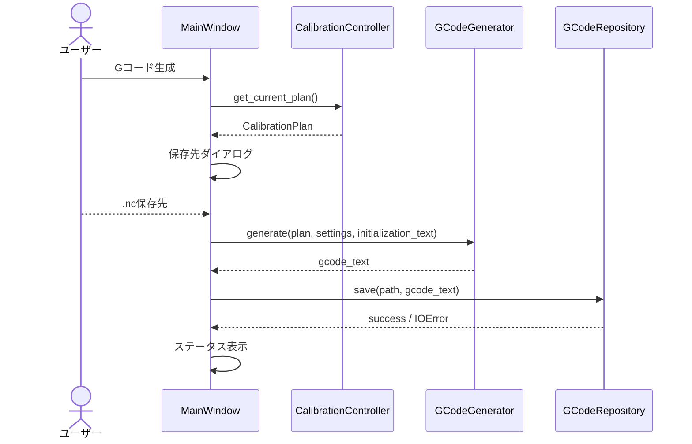

---

# 4. クラス図

```mermaid
classDiagram
    class CalibrationSettings {
        +float aoa_min
        +float aoa_max
        +float aos_min
        +float aos_max
        +int aoa_points
        +int aos_points
        +float tip_offset_x
        +float tip_offset_y
        +float hold_time_s
        +float feed_rate
        +AxisLimits axis_limits
        +bool serpentine
        +bool output_comments
    }
    class AxisRange {
        +float minimum
        +float maximum
    }
    class AxisLimits {
        +AxisRange x
        +AxisRange y
        +AxisRange z
        +AxisRange a
    }
    class CalibrationPoint {
        +int index
        +float aoa
        +float aos
    }
    class AxisCommand {
        +float x
        +float y
        +float z
        +float a
    }
    class PointEvaluation {
        +CalibrationPoint point
        +AxisCommand ideal_command
        +AxisCommand command
        +bool x_saturated
        +bool y_saturated
        +float x_deviation
        +float y_deviation
        +bool rotational_error
    }
    class ValidationIssue {
        +str field
        +Severity severity
        +str message
    }
    class ValidationResult {
        +list issues
        +bool is_valid
    }
    class CalibrationPlan {
        +CalibrationSettings settings
        +list points
        +float max_x_deviation
        +float max_y_deviation
        +bool has_generation_error
    }
    class Severity {
        <<enumeration>>
        ERROR
        WARNING
    }
    class InputValidator {
        +validate(settings) ValidationResult
    }
    class ScanPlanner {
        +generate_points(settings) list
    }
    class AngleTransformer {
        +transform(aoa, aos, previous, limits) tuple
        -generate_equivalent_solutions(theta, phi) list
        -select_solution(candidates, previous, limits) tuple
        -unwrap_angle(angle, previous) float
    }
    class PositionCompensator {
        +calculate_xy(theta, lx, ly) tuple
    }
    class LimitEvaluator {
        +evaluate(command, limits) PointEvaluation
        -saturate_translation(value, range) tuple
        -rotation_in_range(value, range) bool
    }
    class CalibrationService {
        +build_plan(settings) CalibrationPlan
    }
    class CalibrationController {
        +on_settings_changed(raw_input)
        +apply_settings(settings)
        +get_current_settings() CalibrationSettings
        +get_current_plan() CalibrationPlan
        +can_generate() bool
    }
    class SettingsRepository {
        +save(path, settings)
        +load(path) CalibrationSettings
    }
    class InitializationGCodeRepository {
        +load(path) str
    }
    class GCodeGenerator {
        +generate(plan, settings, initialization_text) str
        -format_header(initialization_text) list
        -format_point(point_eval, settings) list
    }
    class GCodeRepository {
        +save(path, text)
    }
    class MainWindow {
        +run()
        -_build_widgets()
        -_collect_raw_input()
        -_find_numeric_parse_errors()
        -_apply_validation_highlights()
        -_on_gui_input_changed()
        -_on_input_changed()
        -_update_validation_display()
        -_update_plan_status()
        -_update_action_state()
        -_on_load_initialization()
        -_on_save_settings()
        -_on_load_settings()
        -_on_simulate()
        -_on_generate_gcode()
    }
    class CalibrationMapView {
        +render(plan)
        -_configure_matplotlib_font()
        -_text(japanese, english)
    }
    class SimulationController {
        +start(plan, duration_s)
        +pause()
        +resume()
        +seek_to_point(point_index)
        +restart_from_beginning()
        +on_animation_complete()
        -_frame_at(plan, progress)
        -_set_playback_state(state)
    }
    class SimulationView {
        +initialize(plan)
        +start_animation(plan, duration_s, frame_provider, on_complete)
        +render_frame(point, progress)
        +show_final_state()
        +set_playback_callbacks(pause, resume, seek)
        +pause_animation()
        +resume_animation()
        +restart_animation(plan, duration_s, frame_provider, on_complete)
        +set_playback_state(state)
        -_on_seek(point_index)
        -_on_play_pause()
        -_update_seek_bar(point_index)
        -_update_playback_button(state)
        -_configure_matplotlib_font()
        -_calculate_side_limits(plan)
        -_calculate_calibration_limits(plan)
        -_configure_side_axes()
        -_configure_front_axes()
        -_configure_calibration_axes()
        -_draw_calibration_map(plan)
        -_update_current_calibration_point(point)
    }

    AxisLimits *-- AxisRange
    CalibrationSettings *-- AxisLimits
    CalibrationPlan *-- PointEvaluation
    PointEvaluation *-- CalibrationPoint
    PointEvaluation *-- AxisCommand
    ValidationResult *-- ValidationIssue
    ValidationIssue --> Severity
    CalibrationService --> ScanPlanner
    CalibrationService --> AngleTransformer
    CalibrationService --> PositionCompensator
    CalibrationService --> LimitEvaluator
    CalibrationController --> InputValidator
    CalibrationController --> CalibrationService
    MainWindow --> CalibrationController
    MainWindow --> SettingsRepository
    MainWindow --> InitializationGCodeRepository
    MainWindow --> GCodeGenerator
    MainWindow --> GCodeRepository
    MainWindow --> CalibrationMapView
    MainWindow --> SimulationController
    SimulationController --> SimulationView
```

---

# 5. コールツリー図（制御フロー）

本図の矢印は**呼出し方向のみ**を表す。データの入出力方向は表さない。

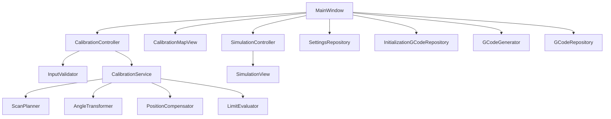

## 5.1 主な制御フロー

通常の入力変更時は次の順で呼び出す。

`MainWindow → CalibrationController → InputValidator`

入力が有効な場合のみ、続いて

`CalibrationController → CalibrationService → ScanPlanner / AngleTransformer / PositionCompensator / LimitEvaluator`

を呼び出す。

GUI表示、シミュレーション、ファイルI/Oは、必要なユーザー操作が発生した時点で `MainWindow` から個別に起動する。

---

# 6. データフロー図

本図の矢印は**データの受け渡し方向**を表す。呼出し関係そのものは表さない。

色は以下の意味で使用する。

- **青色**：処理を実行するソフトウェアモジュール／クラス
- **緑色**：モジュール間で受け渡されるデータ、データモデル、計算結果
- **橙色**：GUIからの生入力やGコード文字列など、システム境界に近い外部入出力データ

色だけに依存せず、ノード名によってもモジュールとデータを識別できるようにする。

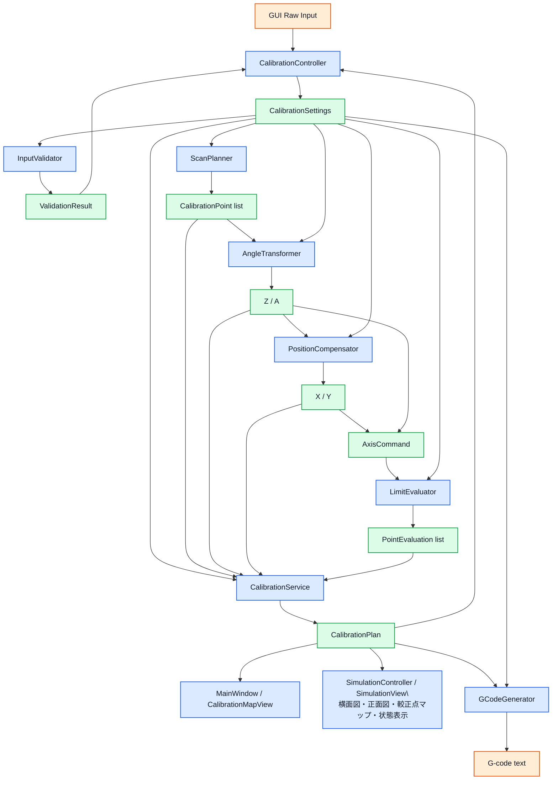
## 6.1 データフローの原則

1. `CalibrationController` はGUI入力を `CalibrationSettings` として保持する。
2. `InputValidator` には `CalibrationSettings` を入力し、`ValidationResult` を返す。したがって、ControllerとValidator間のデータフローは往復する。
3. 入力が有効な場合のみ `CalibrationService` が `CalibrationPlan` を構築する。
4. `ScanPlanner` は `CalibrationSettings` から `CalibrationPoint[]` を生成する。
5. `AngleTransformer` は各 `CalibrationPoint` と設定・前回角度からZ/Aを算出する。
6. `PositionCompensator` はZ角とLx/LyからX/Yを算出する。
7. Z/AとX/Yをまとめた `AxisCommand` を `LimitEvaluator` が評価し、`PointEvaluation` を返す。
8. 全点の `PointEvaluation` を `CalibrationService` が集約して `CalibrationPlan` を生成する。
9. `CalibrationPlan` は較正点マップ、シミュレーション、Gコード生成の共通入力とする。
10. シミュレーションでは同一の `CalibrationPlan` から全較正点マップと現在点の横面図・正面図・強調表示を生成し、別経路で較正点を再計算しない。
11. Gコード生成時に座標計算をやり直さず、同一の `CalibrationPlan` を使用する。

この「単一計算結果の共有」により、GUI表示・シミュレーション・出力Gコードの不一致を防止する。

---

# 7. モジュールリスト

| Pythonモジュール名 | 日本語での意味 | 主なクラス/関数 | 機能概要 |
|---|---|---|---|
| `models.py` | データモデル | `CalibrationSettings`, `AxisLimits`, `CalibrationPoint`, `AxisCommand`, `PointEvaluation`, `CalibrationPlan` | 各層間で受け渡す型を定義する。計算ロジックやGUI依存を持たない |
| `validation.py` | 入力検証 | `InputValidator.validate()` | 入力範囲、点数、保持時間、Feed rate、寸法、可動範囲等を検証し、フィールド単位のエラー情報を返す |
| `scan.py` | 較正点走査計画 | `ScanPlanner.generate_points()` | AoA/AoS等間隔格子、AoA外側ループ、AoS内側ループ、蛇行走査を生成する |
| `transform.py` | 角度座標変換 | `AngleTransformer.transform()`, `generate_equivalent_solutions()`, `select_solution()`, `unwrap_angle()` | AoA/AoSからZ/Aを算出し、等価解・可動範囲・連続性を考慮して解を決定する |
| `positioning.py` | 先端位置補正 | `PositionCompensator.calculate_xy()` | ピッチ回転による先端変位からX/Y補正量を算出する |
| `limits.py` | 可動範囲判定 | `LimitEvaluator.evaluate()` | X/Y飽和、X/Y偏差、Z/A範囲エラーを判定する |
| `calibration_service.py` | 較正計画生成サービス | `CalibrationService.build_plan()` | 点列生成から軸指令、補正、制限判定までを統合し `CalibrationPlan` を構築する |
| `controller.py` | アプリケーション制御 | `CalibrationController` | GUIイベントを受け、入力検証と較正計画再生成を制御し、現在状態を保持する |
| `gcode.py` | Gコード生成 | `GCodeGenerator.generate()` | 初期化コード、`$H`, `G21`, `G90`, `G94`, `G01 ... F...`, `G04`、任意コメントを文字列化する |
| `repositories.py` | ファイル入出力 | `SettingsRepository`, `InitializationGCodeRepository`, `GCodeRepository` | CSV設定、初期化Gコード、`.nc`ファイルの読み書きを担当する。CSV読込時の欠損・空欄・型変換・I/Oエラーを防御的に処理する |
| `map_view.py` | 較正点マップ表示 | `CalibrationMapView` | メインGUIでAoA/AoS点列と警告・エラー状態を表示し、日本語対応フォントがない環境では英語表示へフォールバックする |
| `simulation.py` | 動作シミュレーション | `SimulationController`, `SimulationView` | 約10秒の再生、再生/一時停止、較正点単位のシーク、最終点停止、横面図・正面図、全較正点マップ、現在点強調、現在点・軸値・進捗を表示し、Matplotlibのアニメーションと日本語フォントフォールバックを管理する |
| `gui.py` | GUI | `MainWindow` | Tkinter画面、入力フィールド、背景色による入力エラー強調、固定メッセージ領域、ボタン制御、ファイルダイアログを提供する |
| `main.py` | エントリポイント | `main()` | アプリケーションを初期化してGUIを起動する |

---

# 8. データモデル図

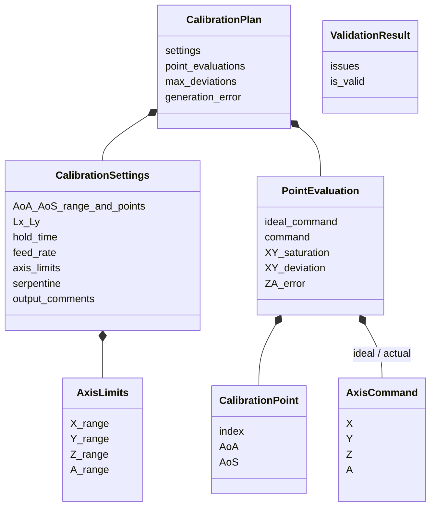

## 8.1 データ不変条件

- `CalibrationPlan` は、入力検証に成功した `CalibrationSettings` からのみ生成する。
- `PointEvaluation.ideal_command` は飽和前の計算結果を保持する。
- `PointEvaluation.command` はGコードおよびシミュレーションに実際に使用する指令値を保持する。
- X/Y範囲超過時のみ `command` を飽和させる。
- Z/A範囲超過時は `command` を飽和させず、`rotational_error` を設定する。
- GUI、シミュレーション、Gコード生成は同一 `CalibrationPlan` を参照する。
- シミュレーションの横面図・正面図・較正点マップの現在点強調は、同一の `PointEvaluation` を参照する。

---

# 9. 状態遷移図

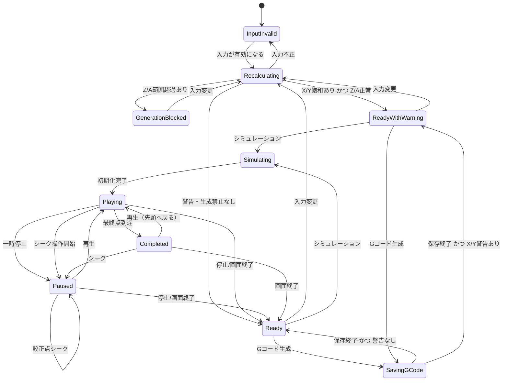

## 9.1 状態別GUI動作

| 状態 | 較正点マップ | シミュレーション | Gコード生成 | 表示 |
|---|---|---|---|---|
| InputInvalid | 更新停止または直前有効結果を保持 | 無効 | 無効 | 入力フィールドを背景色で強調し、既存固定メッセージ領域へ理由表示 |
| Recalculating | 更新中 | 無効 | 無効 | 必要に応じ内部状態のみ |
| GenerationBlocked | 表示可 | 無効 | 無効 | Z/A生成禁止エラー |
| ReadyWithWarning | 表示可 | 有効 | 有効 | X/Y飽和警告・最大偏差 |
| Ready | 表示可 | 有効 | 有効 | 正常 |
| Simulating | メインGUI表示可、シミュレーション画面では現在点を色で強調 | 実行中 | 原則無効 | 横面図・正面図・較正点マップ・進捗・現在点 |
| Playing | 現在点を色で強調 | 再生中 | 原則無効 | シークバー、現在点、Ⅱボタン |
| Paused | 現在点を色で強調 | 一時停止中 | 原則無効 | シークバー、現在点、▶ボタン |
| Completed | 最終点を色で強調 | 最終位置で停止 | 原則無効 | シークバー最終位置、▶ボタン |
| SavingGCode | 表示可 | 原則無効 | 実行中 | 保存状態 |

---

# 10. 要求仕様ID－クラス/メソッド トレーサビリティマトリックス

## 10.1 入力・検証

| 要求ID | 実装クラス/メソッド | 備考 |
|---|---|---|
| [INPUT-001](#architecture-req-input-001) | `MainWindow._build_widgets`, `MainWindow._collect_raw_input`, [[API:models.CalibrationSettings]] | AoA/AoS範囲 |
| [INPUT-002](#architecture-req-input-002) | `MainWindow._build_widgets`, `MainWindow._collect_raw_input`, [[API:models.CalibrationSettings]] | 点数 |
| [INPUT-003](#architecture-req-input-003) | `MainWindow._build_widgets`, `MainWindow._collect_raw_input`, [[API:models.CalibrationSettings]] | Lx/Ly |
| [INPUT-004](#architecture-req-input-004) | `MainWindow._build_widgets`, `MainWindow._collect_raw_input`, [[API:models.CalibrationSettings]], `GCodeGenerator._format_point` | 保持時間、Feed rate |
| [INPUT-005](#architecture-req-input-005) | `MainWindow._build_widgets`, [[API:models.AxisLimits]], [[API:models.AxisRange]] | X/Y/Z/A可動範囲 |
| [INPUT-006](#architecture-req-input-006) | `MainWindow._on_load_initialization`, [[API:repositories.InitializationGCodeRepository.load]] | 初期化Gコード |
| [INPUT-007](#architecture-req-input-007) | `MainWindow._build_widgets`, [[API:models.CalibrationSettings]] | 蛇行走査、コメント |
| [VALID-001](#architecture-req-valid-001) | `CalibrationController.on_settings_changed`, `InputValidator.validate`, `MainWindow._on_gui_input_changed`, `MainWindow._find_numeric_parse_errors`, `MainWindow._apply_validation_highlights`, `MainWindow._update_validation_display` | リアルタイム非モーダル検証、数値パース失敗、フィールド背景強調 |
| [VALID-002](#architecture-req-valid-002) | `InputValidator.validate`, `CalibrationController.can_generate` | 入力整合性 |
| [VALID-003](#architecture-req-valid-003) | [[API:limits.LimitEvaluator.evaluate]], `CalibrationController.can_generate`, `MainWindow._update_action_state` | X/Y警告、Z/A禁止 |

## 10.2 座標変換・位置補正・制限

| 要求ID | 実装クラス/メソッド | 備考 |
|---|---|---|
| [TRANS-001](#architecture-req-trans-001) | [[API:transform.AngleTransformer.transform]] | ピッチ後ロールのモデル |
| [TRANS-002](#architecture-req-trans-002) | [[API:transform.AngleTransformer.transform]], `AngleTransformer._generate_equivalent_solutions` | AoA/AoS→Z/A |
| [TRANS-003](#architecture-req-trans-003) | `AngleTransformer._select_solution` | 等価解優先順位 |
| [TRANS-004](#architecture-req-trans-004) | `AngleTransformer._unwrap_angle` | ±360°ジャンプ回避 |
| [POS-001](#architecture-req-pos-001) | `PositionCompensator.calculate_xy` | X/Y補正式 |
| [POS-002](#architecture-req-pos-002) | `PositionCompensator.calculate_xy` | ロール非依存 |
| [LIMIT-001](#architecture-req-limit-001) | [[API:limits.LimitEvaluator.evaluate]], `LimitEvaluator._saturate_translation` | X/Y飽和 |
| [LIMIT-002](#architecture-req-limit-002) | [[API:limits.LimitEvaluator.evaluate]], `CalibrationService.build_plan`, `MainWindow._update_plan_status` | 最大X/Y偏差の算出・集約・表示 |
| [LIMIT-003](#architecture-req-limit-003) | [[API:limits.LimitEvaluator.evaluate]], `LimitEvaluator._rotation_in_range`, `CalibrationController.can_generate`, `MainWindow._update_plan_status` | Z/A生成禁止判定・表示 |

## 10.3 較正点走査

| 要求ID | 実装クラス/メソッド | 備考 |
|---|---|---|
| [SCAN-001](#architecture-req-scan-001) | `ScanPlanner.generate_points`, `CalibrationController.on_settings_changed` | 等間隔・自動再生成 |
| [SCAN-002](#architecture-req-scan-002) | `ScanPlanner.generate_points` | AoA外側、AoS内側 |
| [SCAN-003](#architecture-req-scan-003) | `ScanPlanner.generate_points` | 蛇行 |

## 10.4 Gコード

| 要求ID | 実装クラス/メソッド | 備考 |
|---|---|---|
| [GCODE-001](#architecture-req-gcode-001) | `MainWindow._on_generate_gcode`, [[API:repositories.GCodeRepository.save]] | `.nc`保存 |
| [GCODE-002](#architecture-req-gcode-002) | `GCodeGenerator._format_header` | 初期化、`$H`, G21/G90/G94 |
| [GCODE-003](#architecture-req-gcode-003) | `GCodeGenerator._format_point` | `G01 X Y Z A F`, `G04 P` |
| [GCODE-004](#architecture-req-gcode-004) | `GCodeGenerator._format_point` | 任意コメント |
| [GCODE-005](#architecture-req-gcode-005) | [[API:gcode.GCodeGenerator.generate]] | 終了時復帰指令なし |

## 10.5 シミュレーション

| 要求ID | 実装クラス/メソッド | 備考 |
|---|---|---|
| [SIM-001](#architecture-req-sim-001) | `MainWindow._on_simulate`, `CalibrationController.can_generate` | 任意実行 |
| [SIM-002](#architecture-req-sim-002) | [[API:simulation.SimulationController.start]], `SimulationController._frame_at`, `SimulationView.start_animation` | 約10秒、保持時間非再現、進捗から現在点を選択 |
| [SIM-003](#architecture-req-sim-003) | [[API:simulation.SimulationView.initialize]], `SimulationView._calculate_side_limits`, `SimulationView._configure_side_axes`, `SimulationView._configure_front_axes`, `SimulationView.render_frame` | 横面図・正面図と固定表示範囲 |
| [SIM-004](#architecture-req-sim-004) | `SimulationView.render_frame` | 点番号、AoA/AoS、X/Y/Z/A、状態、進捗 |
| [SIM-005](#architecture-req-sim-005) | [[API:simulation.SimulationView.initialize]], `SimulationView._calculate_calibration_limits`, `SimulationView._configure_calibration_axes`, `SimulationView._draw_calibration_map` | シミュレーション用AoA/AoS全点マップ |
| [SIM-006](#architecture-req-sim-006) | `SimulationView.render_frame`, `SimulationView._update_current_calibration_point` | 現在点を別色で同期更新、凡例・文字注記なし |
| [SIM-007](#architecture-req-sim-007) | [[CODE:simulation.SimulationController.start]]、[[CODE:simulation.SimulationView.start_animation]]、[[CODE:simulation.SimulationView.set_playback_state]] | 先頭から再生を開始し、再生中はⅡボタンを表示 |
| [SIM-008](#architecture-req-sim-008) | [[API:simulation.SimulationController.pause]], `SimulationView._on_play_pause`, `SimulationView.set_playback_state` | 現在点を保持して一時停止し、▶ボタンを表示 |
| [SIM-009](#architecture-req-sim-009) | [[API:simulation.SimulationController.resume]], `SimulationController.restart_from_beginning` | 一時停止中は現在位置から、最終位置では先頭から再生 |
| [SIM-010](#architecture-req-sim-010) | `SimulationView._on_seek`, `SimulationController.seek_to_point` | 較正点単位のシーク |
| [SIM-011](#architecture-req-sim-011) | `SimulationView._on_seek`, [[API:simulation.SimulationController.pause]] | 再生中のシーク開始時に自動一時停止 |
| [SIM-012](#architecture-req-sim-012) | `SimulationController.seek_to_point`, `SimulationView.render_frame`, `SimulationView._update_seek_bar` | シーク位置を全表示へ即時反映 |
| [SIM-013](#architecture-req-sim-013) | `SimulationController.on_animation_complete`, `SimulationView.show_final_state` | 最終点で停止し、自動ループしない |
| [SIM-014](#architecture-req-sim-014) | [[API:simulation.SimulationView.initialize]], `SimulationView._update_seek_bar` | 既存プログレスバーをシークバーへ置換 |
| [SIM-015](#architecture-req-sim-015) | [[API:simulation.SimulationView.initialize]], `SimulationView._on_seek` | 大きなつまみ、ドラッグ、較正点単位操作 |
| [SIM-016](#architecture-req-sim-016) | `SimulationView.set_playback_state`, `SimulationView._on_play_pause` | 状態に応じたⅡ/▶ボタン表示と操作 |

## 10.6 GUI

| 要求ID | 実装クラス/メソッド | 備考 |
|---|---|---|
| [GUI-001](#architecture-req-gui-001) | `MainWindow._build_widgets`, `CalibrationMapView._configure_matplotlib_font`, `SimulationView._configure_matplotlib_font` | Tkinter日本語GUIとMatplotlib日本語フォント選択。日本語フォント非搭載環境ではグラフ文字列を英語へフォールバック |
| [GUI-002](#architecture-req-gui-002) | [[API:map_view.CalibrationMapView.render]] | AoA/AoSマップ、警告/エラー識別 |
| [GUI-003](#architecture-req-gui-003) | `MainWindow._on_save_settings`, `MainWindow._on_load_settings`, `SettingsRepository.save/load` | CSV設定保存読込、読込失敗時は部分適用せず通知 |
| [GUI-004](#architecture-req-gui-004) | `MainWindow._build_widgets` | 4操作ボタン |
| [GUI-005](#architecture-req-gui-005) | `MainWindow._on_gui_input_changed`, `MainWindow._apply_validation_highlights`, `MainWindow._update_validation_display`, `MainWindow._update_plan_status`, `MainWindow._update_action_state`, `CalibrationController.can_generate` | 入力背景強調、既存固定メッセージ領域、軸警告/エラー、ボタン制御 |

---

# 11. メソッド単位の責務定義

主要メソッドの責務境界を以下に固定し、`docs/test_specification.md` の試験単位と対応させる。

| モジュール | メソッド | 入力 | 出力 | 副作用 |
|---|---|---|---|---|
| validation | `InputValidator.validate` | `CalibrationSettings` | `ValidationResult` | なし |
| scan | `ScanPlanner.generate_points` | `CalibrationSettings` | `list[CalibrationPoint]` | なし |
| transform | `AngleTransformer.transform` | AoA, AoS, previous, limits | Z, A | なし |
| transform | `_generate_equivalent_solutions` | Z, A基本解 | 候補解 | なし |
| transform | `_select_solution` | 候補解, previous, limits | 1解 | なし |
| transform | `_unwrap_angle` | angle, previous | unwrap角 | なし |
| positioning | `PositionCompensator.calculate_xy` | Z角, Lx, Ly | X, Y | なし |
| limits | `LimitEvaluator.evaluate` | `AxisCommand`, `AxisLimits` | 制限判定結果 | なし |
| calibration_service | `CalibrationService.build_plan` | `CalibrationSettings` | `CalibrationPlan` | なし |
| gcode | `GCodeGenerator.generate` | plan, settings, init text | Gコード文字列 | なし |
| repositories | `SettingsRepository.save/load` | path/settings | settings/読込エラー | ファイルI/O、CSV変換 |
| repositories | `InitializationGCodeRepository.load` | path | text | ファイルI/O |
| repositories | `GCodeRepository.save` | path/text | None | ファイルI/O |
| controller | `CalibrationController.on_settings_changed` | GUI入力 | 状態更新 | 内部状態更新 |
| simulation | `SimulationController.start` | plan, duration | None | View初期化・アニメーション開始、再生状態初期化 |
| simulation | `SimulationController.pause` | なし | None | アニメーション一時停止、状態をPausedへ更新 |
| simulation | `SimulationController.resume` | なし | None | 現在位置から、完了後は先頭から再生 |
| simulation | `SimulationController.seek_to_point` | point_index | None | 指定点を即時描画し、Pausedへ更新 |
| simulation | `SimulationController.restart_from_beginning` | なし | None | 完了後に先頭から再生 |
| simulation | `SimulationController.on_animation_complete` | なし | None | 最終点を保持し、Completedへ更新 |
| simulation | `SimulationController.pause` | なし | None | アニメーションタイマー停止、状態をPausedへ更新 |
| simulation | `SimulationController.resume` | なし | None | 現在位置からアニメーション再開 |
| simulation | `SimulationController.seek_to_point` | point_index | None | 指定点を範囲内へ補正し、Viewへ即時描画 |
| simulation | `SimulationController.restart_from_beginning` | なし | None | 先頭点へ移動し再生開始 |
| simulation | `SimulationController.on_animation_complete` | なし | None | 最終点を保持し、状態をCompletedへ更新 |
| simulation | `SimulationController._frame_at` | plan, progress | `PointEvaluation` | なし |
| simulation | `SimulationView._configure_matplotlib_font` | 利用可能フォント | None | Matplotlib font設定 |
| simulation | `SimulationView.initialize` | plan | None | 横面図・正面図・全較正点マップ・状態領域を初期化 |
| simulation | `SimulationView.start_animation` | plan, duration, frame_provider, on_complete | None | `FuncAnimation`生成・タイマー駆動、完了通知 |
| simulation | `SimulationView.set_playback_callbacks` | pause, resume, seek | None | Controllerの再生操作コールバックを登録 |
| simulation | `SimulationView.pause_animation/resume_animation/restart_animation` | 状態/再生引数 | None | Matplotlibタイマーの停止・再開・再生成 |
| simulation | `SimulationView.set_playback_state` | state | None | ボタン表示を状態に同期 |
| simulation | `SimulationView.set_playback_state` | state | None | ボタン表示・シーク操作状態を更新 |
| simulation | `SimulationView._on_seek` | point_index | None | シーク開始時に一時停止し、Controllerへ点選択を通知 |
| simulation | `SimulationView._on_play_pause` | なし | None | 再生/一時停止操作をControllerへ通知 |
| simulation | `SimulationView._update_seek_bar` | point_index | None | シークバーを現在較正点へ同期 |
| simulation | `SimulationView.set_playback_state` | state | None | 状態に応じⅡ/▶を表示 |
| simulation | `SimulationView._calculate_side_limits` | plan | None | 横面図固定表示範囲を保持 |
| simulation | `SimulationView._calculate_calibration_limits` | plan | None | 較正点マップ固定表示範囲を保持 |
| simulation | `SimulationView.render_frame` | current point, progress | None | 3表示と状態を同一現在点で更新 |
| simulation | `SimulationView._draw_calibration_map` | plan | None | 全較正点をAoS横軸・AoA縦軸で描画 |
| simulation | `SimulationView._update_current_calibration_point` | current point | None | マップ上の現在点だけを別色へ更新 |
| map_view | `CalibrationMapView._configure_matplotlib_font` | 利用可能フォント | None | Matplotlib font設定 |
| map_view | `CalibrationMapView.render` | plan | None | メインGUIの較正点マップ描画 |
| gui | `MainWindow._on_gui_input_changed` | Entry入力 | None | パース検証・背景強調・状態更新 |
| gui | `MainWindow._update_validation_display` | `ValidationResult` | None | 背景強調・固定メッセージ更新 |
| gui | `MainWindow._update_plan_status` | `CalibrationPlan` | None | X/Y偏差・Z/A生成禁止状態表示 |
| gui | `MainWindow`各イベント | ユーザー操作 | None | GUI/ダイアログ |

---

# 12. 実装上の設計ルール

1. Core層の関数・メソッドはTkinter、Matplotlib、ファイルI/Oへ依存させない。
2. `CalibrationService.build_plan()` はGUI状態を参照せず、引数だけで同じ結果を返す決定的処理とする。
3. 浮動小数点比較はテスト仕様で定義した許容誤差に従う。
4. `CalibrationPlan` を較正点マップ・シミュレーション・Gコード生成の単一ソースとする。
5. シミュレーション用較正点マップは `SimulationView` の責務とし、メインGUI用 `CalibrationMapView` へシミュレーション固有の現在点状態を持たせない。
6. シミュレーションでは全較正点と現在点を同一 `CalibrationPlan` / `PointEvaluation` 系列から描画し、横面図・正面図・現在点強調を同期させる。
7. X/Yの飽和前値を必ず保持し、偏差計算・警告表示に使用する。
8. Z/Aは範囲超過時に値を改変しない。
9. 設定保存形式は標準ライブラリ `csv` を用いるCSV形式とし、スキーマバージョン番号は保持しない。
10. `SettingsRepository.load()` は必要なCSV項目をすべて取得・型変換できた場合のみ `CalibrationSettings` を生成する。必須項目欠損、空欄、構造不正、数値変換不能、I/Oエラー等は読込失敗として処理し、未処理例外によってアプリケーションを終了させない。
11. 設定読込結果は全項目の読込成功後にのみGUI/Controllerへ適用する。読込途中の値を部分適用してはならない。
12. GUI入力値のパース失敗と、パース成功後の意味的検証エラーを区別する。
13. 入力変更イベントはモーダルダイアログを発生させない。
14. ファイル選択・保存・CSV読込失敗などユーザー起点I/Oの失敗は、アプリケーションを終了させずGUI上で非モーダルに通知する。
15. コード内の各関数・メソッドには `対応要求: REQ-...` をコメントまたはdocstringで記載する。
16. テストコードには `docs/test_specification.md` で定義した `TEST-...` IDをコメントまたはdocstringで記載する。

---

# 13. アーキテクチャ設計書の運用

本書は実装済みコードと要求仕様の対応を示す現行設計書として管理する。

- 構造や責務を変更する実装では、製品コードと同じ変更単位で本書のクラス図、シーケンス図、責務表を更新する。
- 要求IDに対応する実装メソッドが変わった場合は、第10章のトレーサビリティマトリックスを更新する。
- テスト観点の変更は `docs/test_specification.md` に反映し、要求 → アーキテクチャ → テスト仕様 → テストコードの対応を維持する。
- 実装詳細を文書化する際は、要求仕様へ不要なクラス名・内部実装名を持ち込まず、要求と設計の責務境界を維持する。
