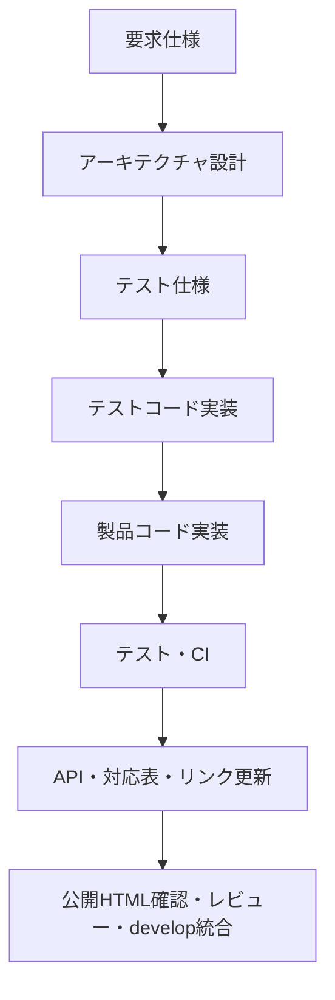

# 開発プロセスルール

本書は、5孔ピトー管較正Gコード生成GUIの機能追加・変更・修正を行うときの工程順序、工程間の受け渡し、完了条件、ブランチ・コミット・レビューを定める。要求や設計の内容、製品コードの技術責務、テストコードの検証方法、IDとリンクの記法は、それぞれの専門ルールを正本とする。

本プロジェクトでは、基本的に次の順序で進める。



実装済み機能のドキュメント修正では、製品コードとテストコードを正本として、実装に合わせて後続の設計書・仕様書・対応表を修正する。リンク修正を理由にコードの挙動を変更してはならない。

## 1. 開発の基本原則

1. 要求を確認してから設計し、設計を確認してからテスト仕様を作成する。
2. テスト仕様をテストコードへ落とし込み、そのテストで確認する振る舞いを明確にしてから製品コードを実装する。
3. 仕様、テスト、製品コードのいずれかを変更したら、下流の成果物とトレーサビリティを確認する。
4. 要求ID、ユースケースID、TEST IDは変更・再採番・再利用しない。
5. 1つの変更を、要求・設計・テスト・実装・文書の対応が確認できる単位で管理する。
6. ドキュメントのみの変更と、製品コード・テストコードの挙動変更を分けて扱う。
7. 完了条件はソース上の記述ではなく、CIと公開HTMLの結果で判定する。

## 1.1 4つのルールの役割分担

4つのルールは、同じ内容を重複して管理しないため、次の範囲を正本とする。

| ルール | 正本とする内容 | 原則として扱わない内容 |
|---|---|---|
| 開発プロセスルール（本書） | 工程の順序、入力/成果物、完了条件、ブランチ、コミット、レビュー | 製品コードの個別アルゴリズム、テストの細かな検証方法、リンク記法の詳細 |
| トレーサビリティ運用ルール | ID体系、成果物間の対応、マトリックス、セマンティックマーカー、アンカー、HTMLリンク監査 | 実装手順そのもの、製品コードの計算方式、テスト手法の詳細 |
| 製品コード開発ルール | 製品コードの層、依存、計算責務、Gコード、API/docstringの技術規約 | 工程の順序、テストコードの詳細、ID/リンク記法の定義 |
| テストコード開発ルール | テストレベル、テストデータ、Mock/実I/O、アサーション、テストdocstringの技術規約 | 全体工程の順序、製品コードの実装方式、リンク記法の正本定義 |

複数の文書に同じ確認項目が現れる場合は、上表の正本を優先し、他の文書では要約または参照にとどめる。工程の順序は本書、IDとリンクはトレーサビリティ運用ルール、製品コードの技術内容は製品コード開発ルール、テストコードの技術内容はテストコード開発ルールに従う。

## 2. 成果物と工程の対応

| 工程 | 主な入力 | 実施内容 | 完了成果物 |
|---|---|---|---|
| 要求定義 | ユーザー要求、既存要求 | EARS形式、受入条件、ID、関連ユースケースを確定 | 要求仕様書 |
| アーキテクチャ設計 | 要求仕様 | UC、シーケンス図、クラス図、内部ブロック図、モジュール責務を定義 | アーキテクチャ設計書 |
| テスト仕様 | 要求、アーキテクチャ | 単体/ユースケースの範囲、条件、期待結果、IDを定義 | テスト仕様書 |
| テスト実装 | テスト仕様、アーキテクチャ上の対象名（実装済みなら製品API） | TEST ID付きのテストコードを実装し、検証根拠を記録 | `tests/` |
| 製品コード実装 | 設計、テストコード | 層の責務に従って製品コードを実装 | リポジトリ直下の製品モジュール |
| 検証 | 製品コード、テストコード | 単体テスト、ユースケーステスト、CI、厳格ビルドを実行 | 成功したCI結果 |
| 文書・リンク整備 | 実装済みAPI、TEST ID | docstring、API、対応表、セマンティックリンクを更新 | 生成ドキュメント |
| 公開・レビュー | 生成ドキュメント | デプロイ済みHTMLのリンク・アンカー・配置を確認し、レビュー後に統合 | 公開サイト、develop |

## 3. 要求仕様工程

### 3.1 変更内容の整理

最初に、追加・変更・不具合修正の対象と、既存機能への影響を整理する。

- 既存の要求、UC、TEST ID、API名、対応表を検索する。
- 新しい要求には未使用の`REQ-<カテゴリ>-NNN`を付与する。
- 既存要求を分割・統合・削除する場合も、旧IDを勝手に付け替えず、変更履歴または削除状態を残す。
- 挙動を変更しないリンク・表現の修正は、機能変更として扱わない。

### 3.2 要求の完了条件

- 要求本文と受入条件が一つの要求IDに対応している。
- 対応するユースケースが明記されている。
- 関連成果物は要求ごとに1つのブロックへまとめられている。
- 関連成果物には、正確な成果物名、ID、製品コードAPI名、テストIDを記載している。
- 実装済み機能の修正では、関連成果物の内容が実際のコード・テストと一致している。

## 4. アーキテクチャ設計工程

### 4.1 設計の順序

要求から対応するユースケースを決め、アーキテクチャ設計書へ落とし込む。

1. 対応するUC IDを決める。
2. アーキテクチャ設計書3.1〜3.6の対応ユースケース節へ配置する。
3. ユースケースごとのシーケンス図を更新する。
4. クラス図、内部ブロック図、モジュールリストの責務を更新する。
5. 入出力、データモデル、層間の依存、エラー処理を確認する。

要求からアーキテクチャへのリンクは、章10の対応表や似た見出しではなく、対応する3.1〜3.6のユースケースへ設定する。

### 4.2 設計の完了条件

- 要求から対応UCへリンクできる。
- UCのリンク先がアーキテクチャ設計書3.1〜3.6のいずれかである。
- シーケンス図の呼出し順と、製品コードの責務分担が矛盾しない。
- クラス・メソッド名は、実装後に実在するAPI名へ確定できる形で管理する。
- 新しい計算責務、状態、入出力、表示要素のテスト観点が列挙されている。

## 5. テスト仕様工程

### 5.1 テストレベルの選択

変更の性質に応じて、単体テストとユースケーステストを使い分ける。

| テストレベル | 適用範囲 | 対応ID |
|---|---|---|
| 単体テスト | 1つのモジュール・クラス・メソッドの責務 | `TEST-UNIT-NNN` |
| ユースケーステスト | 複数モジュールを接続したユーザー操作経路 | `TEST-UC-NN-MM` |

- Coreの計算式・境界・順序は単体テストで確認する。
- Controllerの依存呼出し・状態遷移は、依存先をMock化した単体テストで確認する。
- Repositoryの保存・読み込み・文字コード・例外は、一時ファイルを使った単体テストで確認する。
- 複数モジュール間のデータ受渡し、plan、表示、保存、Gコード生成の経路はユースケーステストで確認する。

### 5.2 テスト仕様の作成

各テストには、次の情報を定義する。

- TEST ID
- 対応する要求IDまたはUC ID
- テスト対象のモジュール・クラス・メソッド
- 前提条件、入力条件、操作
- 期待結果とパスクライテリア
- 正常系、境界値、異常系、複合条件、状態遷移の必要性
- テストコードとの対応

テスト仕様は要求本文を重複管理する場所ではない。要求IDを参照し、テストが観測する具体的な振る舞いと合否条件を記載する。

### 5.3 テスト仕様の完了条件

- 受入条件をテストへ分解できている。
- 境界値は許容境界、境界直下、境界直上を区別している。
- X/Y警告とZ/A生成禁止エラーなど、意味の異なる状態を分けている。
- 単体テストとユースケーステストの重複・抜けが整理されている。
- TEST IDが既存IDを変更せずに付与されている。

## 6. テストコード実装工程

テストコードの設計・実装方法の正本は[テストコード開発ルール](test_doxygen_guideline.md)とする。本工程では、テスト仕様を実行可能なテストへ変換し、製品コードが仕様を満たさない場合に検出できる状態を作る。

- 原則として、テスト仕様を確定した後にテストコードを実装する。製品コードと並行して実装する場合は、対象インターフェースと検証観点を設計で確定し、並行実施の理由をレビュー可能にする。
- 実装前の製品APIが存在しない場合は、アーキテクチャ上の対象名を使用し、製品コード実装後に実在するAPI名へ照合する。
- 各テストにTEST ID、目的、条件、期待結果、検証根拠を対応付ける。
- 対応するテストが独立・再現可能であり、アサーションを弱めて失敗を隠していないことを確認する。

Mock、実I/O、数値許容誤差、GUI/Matplotlibの観測方法などの詳細は、テストコード開発ルールに従う。

## 7. 製品コード実装工程

製品コードの層構成、依存関係、計算責務、Gコード、API/docstringの正本は[製品コード開発ルール](product_code_guideline.md)とする。本工程では、設計とテスト仕様に対応する製品コードを実装し、テストで検証可能な状態にする。

- データモデル、Core、Application、Infrastructure、Presentation、Composition rootの責務を設計に合わせて配置する。
- 較正計算をGUI、シミュレーション、Gコード生成器へ重複実装せず、`CalibrationPlan`を共有する。
- 実装上のAPI名、単位、軸、境界条件、エラー判定を確定し、テストコードとAPIドキュメントへ受け渡す。
- 製品コードの技術的な実装順序、禁止事項、モジュール別ルールは、製品コード開発ルールのチェックリストで確認する。

製品コード実装後は、対象テスト、関連ユースケース、全体テストへ進み、失敗した場合は実装またはテスト仕様との差分を解消してから次工程へ進む。

### 8.1 ローカル確認

変更対象モジュールのテスト実行に加え、4つの開発ルールと5成果物の静的整合性を次のコマンドで確認する。

```text
python tools/check_artifacts.py
```

このチェックはCIでも実行し、成功をレビュー・統合の前提とする。

### 8.1 ローカル確認

### 8.1 ローカル確認

製品コード実装後は、対象を絞ったテストから全体テストへ広げる。

1. 変更対象モジュールの単体テストを実行する。
2. 影響するユースケーステストを実行する。
3. 全単体テスト・ユースケーステストを実行する。
4. APIドキュメントとMkDocsをビルドする。
5. 変更内容、差分、ID、リンクを確認する。

ローカルで全テストを実行できない環境でも、実行できた範囲と未実行範囲を明示し、CIで最終確認する。

### 8.2 CIの完了条件

- GitHub Actionsのテストワークフローが成功している。
- `mkdocs build --strict`相当のドキュメントビルドが成功している。
- mkdocstringsの製品コードAPI・テストコードAPIが生成できている。
- 未定義アンカー、未解決リンク、docstring警告がない。
- 失敗を無視した状態でレビュー・統合へ進まない。

## 9. ドキュメントとトレーサビリティ工程

実装の確定前後に、要求・設計・テスト仕様・APIドキュメントの差分を確認する。各文書の詳細な記載方法は、トレーサビリティ運用ルール、製品コード開発ルール、テストコード開発ルールを正本とする。

### 9.1 実装後・仕様差分時の更新

- 実装後に確定した製品API名・テストAPI名を、要求の関連成果物、設計書、テスト仕様書、対応表へ反映する。
- 仕様変更が発生した場合は、要求から下流成果物への影響を確認し、必要なら設計・テスト仕様・テストコード・製品コードを順に更新する。
- docstring、APIページ、対応表、セマンティックリンクを実在する名前とアンカーへ合わせる。
- リンク修正だけの場合は、製品コード・テストコードの挙動、テストロジック、アサーションを変更しない。

### 9.2 リンク更新の確認先

- ID体系、対応関係、短縮表示、マーカー、アンカー、HTML監査は[トレーサビリティ運用ルール](traceability_rules.md)で確認する。
- 製品API名と製品コードdocstringは[製品コード開発ルール](product_code_guideline.md)で確認する。
- テストAPI名、テストdocstring、テストの検証根拠は[テストコード開発ルール](test_doxygen_guideline.md)で確認する。

## 10. ブランチ・コミット・レビュー

### 10.1 ブランチ運用

- `develop`を統合先とする。
- 機能・修正・文書整備ごとに`feature/<topic>`ブランチを作る。
- 1つのfeatureブランチでは、目的が追跡できる範囲の変更を行う。
- 完了したfeatureはPull Requestで`develop`へ統合する。
- 開発中のドキュメント公開が必要な場合は、CI設定で対象ブランチを明示し、公開先と統合先を混同しない。

### 10.2 コミット運用

コミットは1つの論理的な変更にまとめ、変更種別が分かる接頭辞を使用する。

| 接頭辞 | 用途 |
|---|---|
| `feat:` | 機能追加 |
| `fix:` | 不具合修正 |
| `test:` | テストコード・テスト検証 |
| `test-spec:` | テスト仕様の追加・変更 |
| `docs:` | 仕様書、設計書、API、リンク、ルール |
| `refactor:` | 挙動を変えない構造変更 |
| `style:` | 表示・レイアウト・書式 |
| `ci:` | CI・デプロイ設定 |
| `chore:` | 雛形、設定、保守作業 |

要求、設計、テスト仕様、テストコード、製品コード、文書をすべて1コミットへ混在させる必要はない。工程ごとのコミットを分けることで、レビューと原因追跡を容易にする。

### 10.3 Pull Requestレビュー

レビューでは、実装の正しさだけでなく、下流成果物との対応を確認する。

- 要求IDと受入条件が明確である。
- アーキテクチャのUC・責務・図が更新されている。
- テスト仕様とテストコードが対応している。
- 製品コードAPI名が実装と一致している。
- トレーサビリティの各リンクが正しい成果物へ到達する。
- CIとドキュメントビルドが成功している。
- docs-only変更で製品コード・テストコードが意図せず変更されていない。

## 11. 変更種別ごとの扱い

### 11.1 新機能

要求 → アーキテクチャ設計 → テスト仕様 → テストコード → 製品コード → テスト/CI → 文書・リンク → 公開HTML確認の全工程を実施する。

### 11.2 不具合修正

再現条件をテスト仕様へ追加し、可能なら先に失敗するテストを作成する。製品コードを修正した後、回帰テスト、関連ユースケース、ドキュメントの整合性を確認する。

### 11.3 リファクタリング

外部挙動を維持することをテストで確認する。API名、モジュール構成、依存関係が変わる場合は、設計・docstring・対応表・リンクを更新する。

### 11.4 ドキュメント・リンクのみの修正

- 製品コードとテストコードの内容を確認して、ドキュメントを実装へ合わせる。
- APIアンカー、要求アンカー、テストアンカーの実在を公開HTMLまたは生成HTMLで確認する。
- 製品コード、テストコード、テストロジック、アサーションを変更しない。
- CIのドキュメントビルドと公開HTMLのリンク監査を実施する。

## 12. 公開完了とリンク監査

デプロイ後、次の確認が完了して初めて変更を完了とする。

- 要求仕様、アーキテクチャ設計、テスト仕様、製品コードAPI、テストコードAPIが公開されている。
- 要求から対応UCのアーキテクチャ設計書3.1〜3.6へ遷移する。
- 要求ID、TEST ID、UC ID、API名、テストコード名が各正しい成果物へ遷移する。
- マトリックスの短縮IDが全番号・リンク付きで表示される。
- すべての内部フラグメントリンクの遷移先に対象`id`が存在する。
- ナビゲーション、目次、外部GitHubリンクなどの一般リンクと、トレーサビリティリンクを区別して確認する。
- 未知の内部リンク種別や実装と異なるリンク先がない。

## 13. 開発完了チェックリスト

- [ ] 変更種別と対象範囲を明確にした。
- [ ] 要求ID・UC ID・TEST IDを既存IDの変更なしで整理した。
- [ ] 要求の受入条件と関連成果物を更新した。
- [ ] アーキテクチャ設計書3.1〜3.6の対応UC・責務・図を更新した。
- [ ] 単体テストまたはユースケーステストの範囲とIDを定義した。
- [ ] テストコードに検証根拠とTEST IDを記載した。
- [ ] 製品コードを正しい層へ実装し、責務を重複させていない。
- [ ] `CalibrationPlan`を表示・シミュレーション・Gコード生成で共有している。
- [ ] API・docstring・対応表を実在する名前へ更新した。
- [ ] CI、全テスト、厳格ビルドが成功している。
- [ ] デプロイ済みHTMLのリンクとアンカーを確認した。
- [ ] Pull Requestレビューを完了し、`develop`へ統合できる状態である。