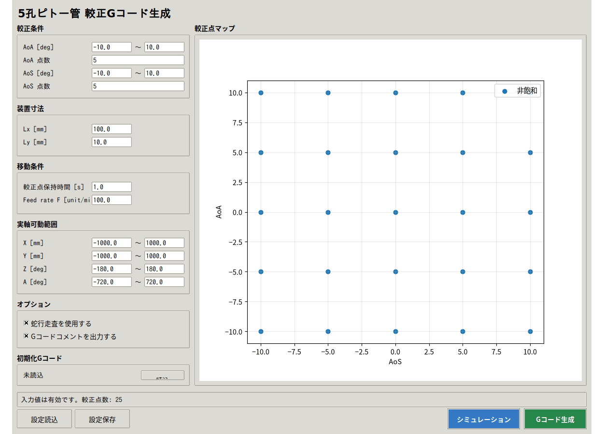

# 5孔ピトー管較正Gコード生成

5孔ピトー管の較正条件をもとに、GRBL対応の4軸（X/Y/Z/A）Gコードを生成するGUIアプリケーションのドキュメントサイトです。

本サイトでは、要求仕様、アーキテクチャ設計、テスト仕様、製品コードAPI、テストコードAPI、および開発ルールを一つの構成で参照できます。

## 製品概要

本ツールは、AoA（迎角）とAoS（横滑り角）の較正点を生成し、ピッチ・ロールへの変換、X/Y補正、実軸可動範囲の検証、蛇行走査、保持時間、Feed rateを反映した較正計画を作成します。計画はGUI上の較正点マップとシミュレーションで確認でき、問題がなければGRBL向けのGコードとして保存できます。

## 基本操作

1. 較正範囲、較正点数、装置寸法、保持時間、Feed rateを入力します。
2. X/Y/Z/Aの実軸可動範囲と必要なオプションを設定します。
3. 較正点マップと状態表示で、範囲逸脱や生成禁止状態がないことを確認します。
4. シミュレーションで横面図、正面図、較正点マップ、走査順を確認します。
5. 問題がなければGコードを生成し、保存内容を確認してからCNC.js／GRBLへ読み込みます。



詳細な操作手順、画面資料、使用上の注意は[READMEの操作説明](https://github.com/Pakfat50/FiveHolePitotTubeCalibration#起動からgコード生成まで)を参照してください。

!!! warning "実機使用時の注意"
    シミュレーションは実機を動かしません。また、機械の安全確認や干渉確認を完全には代替しません。実機運転前に、CNC.js、GRBL、原点、工具・治具、非常停止を確認してください。

## ドキュメント一覧

| 分類 | 内容 |
|---|---|
| 要求仕様 | [較正GUI要求仕様](pitot_calibration_gui_spec.md) |
| アーキテクチャ設計 | [アーキテクチャ設計書](architecture_design.md) |
| テスト設計 | [テスト仕様書](test_specification.md) |
| コードドキュメント | [製品コードAPI](api.md) / [テストコードAPI](test-api.md) |
| 開発ルール | [開発プロセスルール](development_process_guideline.md) / [トレーサビリティ運用ルール](traceability_rules.md) |
| 開発ルール | [製品コード開発ルール](product_code_guideline.md) / [テストコード開発ルール](test_doxygen_guideline.md) |

## ローカルプレビュー

リポジトリのルートで以下を実行します。

```bash
python -m pip install mkdocs-material mkdocstrings[python]
mkdocs serve
```

ブラウザで http://127.0.0.1:8000/ を開いて確認できます。
